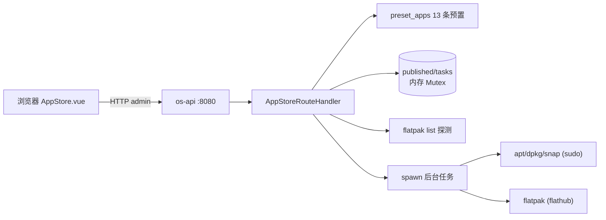

# 应用中心（AppStore）

> 源码：`crates/os-api/src/handlers/app_store.rs`（`AppStoreRouteHandler`，组件名 `app_store`）·
> 前端：`crates/os-api/web/src/views/AppStore.vue`（路由 `/appstore`，appRegistry id=`appstore`）
> 登记：2026-08-20 · 所有路由表/env 均从源码 grep 核实

## 1. 功能说明

桌面"应用中心"应用的后端 REST 入口：把 HTTP 请求翻译为 **Ubuntu 兼容应用（apt / deb / snap / flatpak）**
的发布、浏览、安装/卸载任务管理。

- **预置目录**：构造时预置 13 个常用应用（VLC / OBS / HandBrake / VS Code / Docker / GitKraken /
  LibreOffice / GIMP / Firefox / Transmission / HTop / GParted / Steam），覆盖
  media / dev / office / internet / system / game 六大分类（`preset_apps()`，
  app_store.rs:249）。
- **用户发布**：`POST /publish` 把自定义应用追加到目录（category 默认 `custom`、install_type 默认 `apt`，
  id 形如 `custom-<seq>`）；`DELETE /published/:id` 移除。
- **安装/卸载**：fire-and-forget 后台任务。命令由纯函数构造（`build_install_cmd` app_store.rs:180 /
  `build_uninstall_cmd` app_store.rs:221）：apt → `sudo apt-get install -y <pkg>`、deb → `sudo dpkg -i <file>`、
  snap → `sudo snap install <name>`、flatpak → `flatpak install -y flathub <id>`；tokio::process 真实
  spawn，记 pid，退出码非 0 / spawn 失败降级为 `failed` 状态并保留输出尾部 10 行（`log_tail`），绝不 panic。
- **已安装探测**：`GET /installed` 经 `spawn_blocking` 只跑 `flatpak list --columns=application,version`
  （dpkg / snap 探测已按需求移除——只显示开发者发布的软件，不显示系统包，app_store.rs:476-486）；
  flatpak 未安装 → 返回空数组，不报错。

## 2. 组件拓扑与数据流

```
浏览器 AppStore.vue ──POST /api/v1/appstore/install──▶ os-api 网关（Auth: admin）
        │                                                    │
        │ GET /apps /categories /stats                       ▼
        │                                          AppStoreRouteHandler
        │                                           ┌───────┼─────────────┐
        │                                           ▼       ▼             ▼
        │                                     preset_apps() published     tasks
        │                                     （代码常量13条） Mutex<Vec>  Mutex<Vec>
        │                                           │       （内存）      （内存）
        │ GET /installed                           │
        ▼                                           ▼
浏览器 ◀──────── JSON ───────────── spawn_blocking: flatpak list（宿主 flatpak）
                                                    │
                                     POST /install → build_install_cmd() 纯函数
                                                    ▼
                                     tokio::process::spawn（后台，fire-and-forget）
                                     sudo apt-get install -y <pkg>   （apt/deb/snap）
                                     flatpak install -y flathub <id> （flatpak）
                                                    │ 退出码回写 tasks（pid/log_tail）
                                                    ▼
                                          宿主包管理器（apt/dpkg/snap/flatpak）
```

安装任务数据流：`POST /install(app_id) → 查目录拿 install_type/target → 建 pending 任务 →
spawn 命令 → installing(pid) → completed/failed(log_tail 尾 10 行) → 成功回写 installed`。



## 3. 路由表（11 条，component="app_store"）

| method | path | 鉴权 | 动作 |
|--------|------|------|------|
| GET | `/api/v1/appstore/apps` | 公开 | 列商店应用（支持 `?category=` 过滤） |
| GET | `/api/v1/appstore/apps/:id` | 公开 | 单应用详情（404=不存在） |
| GET | `/api/v1/appstore/categories` | 公开 | 分类列表（含应用数；预置分类顺序在前） |
| GET | `/api/v1/appstore/installed` | 公开 | 列已安装应用（仅 flatpak 探测） |
| POST | `/api/v1/appstore/install` | admin | 创建安装任务（201 返回 InstallTask） |
| POST | `/api/v1/appstore/uninstall` | admin | 创建卸载任务 |
| GET | `/api/v1/appstore/tasks` | 公开 | 列安装任务 |
| GET | `/api/v1/appstore/tasks/:id` | 公开 | 任务详情（含 `log_tail`） |
| POST | `/api/v1/appstore/publish` | admin | 发布应用（201；name/install_target 空则 400） |
| DELETE | `/api/v1/appstore/published/:id` | admin | 删除用户发布的应用（404=不存在） |
| GET | `/api/v1/appstore/stats` | 公开 | 聚合统计（total_apps/installed/categories/publishing_enabled） |

安装任务状态机：`pending → installing（记 pid）→ completed | failed`（app_store.rs:95-96）。

## 4. 数据存储

| 数据 | 存储 | 说明 |
|------|------|------|
| 预置应用目录 | 代码内常量（`preset_apps()`） | 每次进程启动重建 |
| 用户发布的应用 | **内存**（`Mutex<Vec<StoreApp>>`） | **重启即丢** |
| 安装任务列表 | **内存**（`Mutex<Vec<InstallTask>>`） | **重启即丢**；pid 仅运行中有值 |
| 已安装探测 | 无存储，实时探测 | flatpak list |

## 5. 环境变量

无专属 env（源码 grep `app_store.rs` 无 `env::var` 调用）。安装/卸载依赖：

- 宿主机安装 `apt-get` / `dpkg` / `snap` / `flatpak` 对应工具链；
- `sudo` 可用——apt/deb/snap 命令以 `sudo` 前缀 spawn 且 **stdin 关闭（Stdio::null()）**，
  需免密 sudo（NOPASSWD）才能成功；交互式输密码的 sudo 会直接失败（任务标 `failed`）。

## 6. 已知限制

1. **内存态不持久**：用户发布的应用与安装任务在 os-api 重启后清空（预置目录不受影响）。
2. **sudo 交互**：安装/卸载走 `sudo` 且无密码管道，配置了密码的 sudo 环境任务必 failed
   （`log_tail` 里能看到 sudo 报错）。
3. **无任务重试/取消**：任务 fire-and-forget，运行中不能取消；同应用可重复建任务（不去重）。
4. **installed 字段仅对用户发布应用回写**：预置应用的 `installed` 布尔每次重启复位（app_store.rs:559-568）。
5. **snap 安装的预置应用（firefox/gitkraken）无法经 `/installed` 探测**（snap 探测已移除）。
