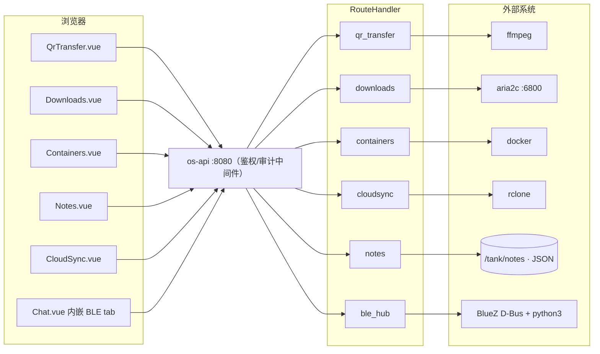

# 系统类/应用类适配器应用速查（APPS REFERENCE）

> 本文收录单写太薄的"适配器型"桌面应用：每个应用给 **路由表 / 数据存储 / 关键行为 / env**。
> 高复杂度应用（应用中心/区块链/监控/NexHub/转发/存储共享/媒体生成等）有独立文档，见
> [docs/README.md](README.md) 索引。
> 登记：2026-08-20 · 全部路由表与常量从 `crates/os-api/src/handlers/*.rs` 源码核实
> **PPT 素材**：§0 总拓扑 + 每应用一行的组件拓扑速查（§1–§6 内嵌）

---

## 0. 六应用统一拓扑模式

六个适配器应用共享同一骨架（区别只在右端的外部系统与落盘物）：

```
浏览器 Vue view ──HTTP(admin 写/公开读)──▶ os-api 网关 ──▶ XxxRouteHandler
                                                        ├─ 内存任务表 Mutex（重启丢）
                                                        └─ spawn 子进程 / spawn_blocking IO
                                                             ▼
                                            外部系统：ffmpeg / aria2c :6800 / docker /
                                            rclone / flatpak / BlueZ+python3
                                            落盘：/tank/os-data/* 或 /tmp 降级
```

| 应用 | handler → 外部系统 | 持久化 |
|------|-------------------|--------|
| QR 传输 | qr_transfer → ffmpeg（合帧/拆帧）+ qrcode/rqrr 纯 Rust | /tank/os-data/qr-{videos,decoded}（任务内存） |
| 下载中心 | downloads → aria2c JSON-RPC :6800（按需自动拉起） | aria2 进程内（无 session 文件） |
| 容器管理 | containers → `sg docker -c` 子进程 | docker 自身 |
| 笔记 | notes → tokio::fs JSON 读写 | /tank/notes → /var/lib/os/notes → 内存三段式 |
| 云同步 | cloudsync → rclone sync 子进程（记 pid） | 任务内存；远端配置在 ~/.config/rclone |
| BLE 中继 | ble_hub → python3 GATT 脚本（BlueZ D-Bus） | /tank/os-data/ble-nodes.json |



---

## 1. QR 传输（QrTransfer，`/qrtransfer`）

源码：`handlers/qr_transfer.rs`（组件 `qr_transfer`，9 条路由）· 前端 `views/QrTransfer.vue`

**功能**：文件 ↔ "跳动 QR 视频"互转（隔屏传输）。编码：文件二进制 → Base64 → 分块（默认 2048 字符）→
逐块生成 QR 帧（纯 Rust `qrcode` crate）→ ffmpeg 合成 MP4（默认 5 fps）；解码：上传视频/图片 →
ffmpeg 拆帧 → `rqrr` 逐帧解码 → 按 seq 拼接 → CRC32 校验 → 写文件。帧协议 JSON header
`{seq,total,crc,data}`。

拓扑：`QrTransfer.vue → os-api → QrTransferRouteHandler → 后台 tokio 任务 → [qrcode 生成 QR 帧 → ffmpeg 合成 MP4] / [ffmpeg 拆帧 → rqrr 解码] → /tank/os-data/qr-{videos,decoded}（降级 /tmp）`。

| method | path | 鉴权 | 动作 |
|--------|------|------|------|
| POST | `/api/v1/qr/encode` | admin | 创建编码任务（body: file_path, fps?, chunk_size?） |
| GET | `/api/v1/qr/encode/:id` | 公开 | 任务状态 + 视频路径 |
| GET | `/api/v1/qr/encode/:id/video` | 公开 | 下载/流式播放 QR 视频 |
| POST | `/api/v1/qr/decode` | admin | 创建解码任务（上传视频/图片） |
| GET | `/api/v1/qr/decode/:id` | 公开 | 任务状态 + 输出文件路径 |
| GET | `/api/v1/qr/decode/:id/file` | 公开 | 下载解码产物 |
| POST | `/api/v1/qr/encode-text` | admin | 文本 → QR 图片（即时） |
| POST | `/api/v1/qr/decode-text` | admin | QR 图片 → 文本（即时） |
| GET | `/api/v1/qr/stats` | 公开 | 聚合统计 |

存储：视频 `/tank/os-data/qr-videos/<id>.mp4`（降级 `/tmp/os-qr-videos`）；解码产物
`/tank/os-data/qr-decoded/<id>.bin`（降级 `/tmp/os-qr-decoded`）；**任务表内存态（重启丢）**。
env：无。已知限制：依赖宿主 `ffmpeg`（不存在任务标 failed 不 panic）；CRC 不符仍输出但 `crc_ok=false`；
大文件视频巨大（5fps × N 帧）。

---

## 2. 下载中心（Downloads，`/downloads`）

源码：`handlers/downloads.rs`（组件 `downloads`，7 条路由）· 前端 `views/Downloads.vue`

**功能**：真实 **aria2** JSON-RPC（`http://localhost:6800/jsonrpc`）下载任务管理。首次 POST /tasks 若
RPC 不在线，自动 spawn `aria2c --enable-rpc --rpc-listen-all --rpc-listen-port=6800 -d /tank/downloads`
守护进程；之后 create/pause/resume/cancel/list 全走 aria2 方法（addUri/tellActive/tellWaiting/
tellStopped/pause/unpause/remove/removeDownloadResult）。aria2 未装 / RPC 不通 → 降级空列表或 failed。

拓扑：`Downloads.vue → os-api → DownloadsRouteHandler → reqwest JSON-RPC → aria2c :6800（首次不在线则 spawn `aria2c --enable-rpc -d /tank/downloads` 收养为守护） → 下载文件落 /tank/downloads（SMB 共享 nexos-downloads 同目录）`。

| method | path | 鉴权 | 动作 |
|--------|------|------|------|
| GET | `/api/v1/downloads/tasks` | 公开 | 列全部任务（active+waiting+stopped） |
| POST | `/api/v1/downloads/tasks` | admin | 创建（body: **url + save_path 均必填**，name 可选；空则 400） |
| POST | `/api/v1/downloads/tasks/:id/pause` | admin | 暂停（aria2.pause） |
| POST | `/api/v1/downloads/tasks/:id/resume` | admin | 继续（aria2.unpause） |
| POST | `/api/v1/downloads/tasks/:id/cancel` | admin | 取消（aria2.remove） |
| DELETE | `/api/v1/downloads/tasks/:id` | admin | 删除结果（removeDownloadResult） |
| GET | `/api/v1/downloads/stats` | 公开 | 统计 |

存储：任务真源在 **aria2 进程内**（未配 session 文件持久化）——os-api 重启后 aria2 若还在跑任务不丢，
但 aria2 自身重启任务列表即清空。下载根目录常量 `/tank/downloads`（downloads.rs:60；SMB 共享
`nexos-downloads` 指向同目录，见 STORAGE_SHARING.md）。env：无（RPC 端口/目录均为常量）。
已知限制：仅 HTTP/FTP/magnet（aria2 能力面）；无批量/队列优先级；`save_path` 需前端显式传。

---

## 3. 容器管理（Containers，`/containers`）

源码：`handlers/containers.rs`（组件 `containers`，8 条路由）· 前端 `views/Containers.vue`

**功能**：真实 **Docker** 子进程管理（经 `sg docker -c '...'` 重新初始化组会话访问 docker socket——
用户在 docker 组但旧 session 组身份未刷新的 workaround）。docker 不存在 / sg 失败 / 守护进程未跑 →
降级空列表或 failed，不 panic。

拓扑：`Containers.vue → os-api → ContainersRouteHandler → spawn 'sg docker -c "<cmd>"' → docker ps/run/start/stop/rm/images → docker daemon（/var/run/docker.sock）`。

| method | path | 鉴权 | 动作 |
|--------|------|------|------|
| GET | `/api/v1/containers/list` | 公开 | 列容器（`docker ps -a --format json`） |
| POST | `/api/v1/containers/create` | admin | 创建（`docker run -d`） |
| POST | `/api/v1/containers/:id/start` | admin | 启动 |
| POST | `/api/v1/containers/:id/stop` | admin | 停止 |
| POST | `/api/v1/containers/:id/restart` | admin | 重启 |
| DELETE | `/api/v1/containers/:id` | admin | 删除（`docker rm -f`） |
| GET | `/api/v1/containers/images` | 公开 | 列镜像（`docker images`） |
| GET | `/api/v1/containers/stats` | 公开 | 统计（从 docker ps 聚合） |

存储：无（容器/镜像即 docker 自身状态）。env：无。已知限制：`cpu_percent`/`mem_usage_mb` 固定 0.0
（docker ps 取不到，未接 `docker stats`）；无日志/exec/网络管理；依赖宿主 docker 组权限。

---

## 4. 笔记（Notes，`/notes`）

源码：`handlers/notes.rs`（组件 `notes`，6 条路由）· 前端 `views/Notes.vue`

**功能**：markdown 笔记的增删改查，`<id>.json` 逐条落盘。

拓扑：`Notes.vue → os-api → NotesRouteHandler → spawn_blocking tokio::fs → /tank/notes/<id>.json（→ /var/lib/os/notes → 内存+demo 三段降级）`。

| method | path | 鉴权 | 动作 |
|--------|------|------|------|
| GET | `/api/v1/notes` | 公开 | 列全部（摘要，不含 content） |
| GET | `/api/v1/notes/:id` | 公开 | 单条（含 content） |
| POST | `/api/v1/notes` | admin | 创建（title/content/tags） |
| PUT | `/api/v1/notes/:id` | admin | 更新 |
| DELETE | `/api/v1/notes/:id` | admin | 删除 |
| GET | `/api/v1/notes/stats` | 公开 | 统计 |

存储目录优先级：`/tank/notes`（ZFS 池在则用）→ `/var/lib/os/notes`（自动创建）→ 只读环境回退**内存态
+ 2 条 demo 笔记**。读写经 `spawn_blocking`；id = 计数器 + 纳秒时间戳。env：无。
已知限制：无全文搜索/版本历史/附件；并发编辑后写覆盖（无乐观锁）。

---

## 5. 云同步（CloudSync，`/cloudsync`）

源码：`handlers/cloudsync.rs`（组件 `cloudsync`，7 条路由）· 前端 `views/CloudSync.vue`

**功能**：真实 **rclone** 子进程编排。任务定义（local_path/remote_provider/remote_path/sync_mode）
在**内存**；`sync`/`resume` 真实 spawn `rclone sync <local> <remote>:<path> --progress`（后台跑、stderr
落日志、记 pid）；`pause` = kill pid（rclone 无原生暂停）；`GET /tasks` 探测 pid 存活刷新状态。
remote 须事先 `rclone config` 配好（S3/WebDAV/OneDrive/Google Drive/阿里云 OSS），`remote_provider`
填 rclone remote 名。

拓扑：`CloudSync.vue → os-api → CloudSyncRouteHandler → spawn 'rclone sync <local> <remote>:<path> --progress'（记 pid，pause=kill） → 云端对象存储`。

路由：`GET|POST /api/v1/cloudsync/tasks`、`POST .../tasks/:id/sync|pause|resume`、
`DELETE .../tasks/:id`（均 admin，GET 公开）、`GET /api/v1/cloudsync/stats`。
存储：任务内存（**重启丢**——FEATURE_SURVEY §1.1③ 列为待办：share.rs 的 JSON 落盘模式可直接复制）。
env：无。已知限制：rclone 未装降级 error；无定时调度（手动触发）；无排除规则透传。

---

## 6. BLE Mesh 中继（BleHub，无独立路由）

源码：`handlers/ble_hub.rs`（组件 `ble_hub`，10 条路由）· 前端 `views/BleHub.vue`（**未注册独立路由**，
作为 Chat 的 BLE tab 内嵌，实验性）

**功能**：OS 作 BLE mesh 节点 + 互联网网关——手机离线（无蜂窝/Wi-Fi）时经 BLE mesh 多跳中继通信
（A↔B↔C）。开放 mesh 无需配对；节点发现通告（id+可达列表）+ `compute_routing` 推导 hop 路由表；
消息 flooding + msg_id 去重防环。`POST /start` spawn Python GATT 脚本（BlueZ D-Bus，脚本由纯函数
构造写 `/tmp/os_ble_mesh.py`，fire-and-forget），Python/dbus/BlueZ 不可用 → `running=false` 不 panic。

拓扑：`Chat.vue BLE tab → os-api → BleHubRouteHandler → spawn python3 /tmp/os_ble_mesh.py（BlueZ D-Bus 注册 GATT 外设 + mesh relay） ↔ BLE mesh 邻居手机；节点表落 /tank/os-data/ble-nodes.json`。

路由：`GET /api/v1/ble/status` · `POST /ble/start|stop`（admin）· `GET|DELETE /ble/nodes[/:id]` ·
`POST /ble/discover` · `GET /ble/routing` · `POST|GET /ble/messages` · `GET /ble/stats`。
存储：节点 `/tank/os-data/ble-nodes.json`（降级 `./ble-nodes.json`）；消息历史内存。
env：无。已知限制：依赖 BlueZ + python3-dbus；mesh 消息不落 IM 库（与 IM 通道未打通）；
FEATURE_SURVEY 不计入 30 应用清单。

---

## 附：本文收录应用的共同模式

1. **降级不 panic**：外部二进制（ffmpeg/aria2/docker/rclone/python3）缺失或失败一律降级为
   空列表 / failed / error 响应。
2. **写操作 admin 鉴权**：POST/PUT/DELETE 全部 `requires_auth + roles=["admin"]`
   （经 `NEXOS_ADMIN_TOKEN` 或 JWT，见 DEPLOYMENT.md §9）。
3. **内存态任务表普遍存在**（QR/CloudSync/Downloads 的 aria2 状态外）：重启即丢是这些应用的
   共性技术债，落盘改造模式可参考 `notes.rs`（目录探测三段式）与 `share.rs`（JSON 落盘）。
4. env：本篇 6 个应用**均无专属 env**（grep `env::var` 为证）；全局 env 见
   [DEPLOYMENT.md](DEPLOYMENT.md) §9。
