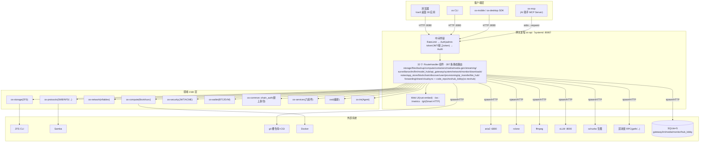

# OS 系统架构详解（ARCHITECTURE）

> 面向新开发者的系统设计导览。读完本文你应能回答：这个系统是什么、为什么这样切 crate、
> 各层各 crate 负责什么、关键链路的数据怎么流、测试怎么分层。
>
> 配套阅读：
> - [HANDOVER.md](./HANDOVER.md) §3（已定决策 ADR）/ §4（全程里程碑）/ §9（集成测覆盖）——⚠️ 截至 2026-08-07，数字以 MEMORY.md 为准
> - [DEPENDENCIES.md](./DEPENDENCIES.md)（技术栈选型归档）
> - [docs/adr/](./adr/)（8 个架构决策记录）
> - 主规划文档 `OS_系统_Rust技术路线规划.md`（SSOT，§3 分 crate 规格 / §15 接口契约索引）
>
> **更新**：2026-08-21。workspace 已扩到 **27 crate**（25 业务 + `os-integration` + `nettest`，新增 `os-p2p`）；
> os-api 现为 **30 个常驻 RouteHandler 组件**（+1 个条件 `extra`）+ 内嵌 Vue3 Web UI（31 个 view），
> 当前规模/测试/应用数以 [README.md](../README.md) 与 MEMORY.md（仓库根）为准。

---

## 1. 系统概述

### 1.1 这是什么

本项目是一个**纯 Rust 实现的网络附加存储（OS）操作系统核心**，定位为自托管的家庭/小型
企业数据中心中枢。它不只是一个文件共享服务，而是一套覆盖**存储、网络、计算、安全、共识、
协议、AI 协作、客户端**的完整系统软件层——从 ZFS 池管理、KVM/OCI 计算、防火墙/DHCP/PXE
网络，到 SMB/NFS/WebDAV/FTP/SFTP/对象存储协议，再到 A/B OTA 升级、HA 集群（Raft）、
CLIP 语义搜索与多 Agent AI 协作，全部用 Rust 编排。最终产物形态包括一个 systemd 编排的
守护进程（`osd`）、一个可安装 ISO（`os-iso`），以及手机/桌面/CLI 三端客户端。

### 1.2 为什么是纯 Rust

技术栈选型的第一原则是**纯 Rust + 最小系统依赖 + 可重现构建**。这一原则贯穿全部依赖裁决：

- **TLS 栈选 rustls（ring 后端）而非 native-tls/openssl**——避免 openssl 的系统库依赖与
  license 复杂度（见 [ADR-DEPS-001](./adr/ADR-DEPS-001-p0-p1-third-party-deps.md)）。
- **Git 用 gix 而非 libgit2**、**SSH 用 russh 而非 libssh2**——纯 Rust 无 FFI 维护负担。
- **SQLite 用 rusqlite `bundled` feature 内嵌编译**——规避系统 libsqlite3 依赖。
- **CLIP 推理用 candle 而非 ONNX Runtime / Python 桥接**——无 C++ 运行时、无 Python 依赖
  （见 [ADR-DEPS-005](./adr/ADR-DEPS-005-clip-backend.md)）。
- **加密用 RustCrypto 的 `aes-gcm`**——纯 Rust AEAD，与 ring 后端互不冲突
  （见 [ADR-DEPS-003](./adr/ADR-DEPS-003-aead.md)）。

少数无法回避的 FFI（libvirt/nftables/netlink）全部用 **feature gate 门控**（如 `virt-ffi`、
`nftnl-ffi`），缺系统库时自动回退骨架实现，保证无该依赖的环境（CI、开发机）仍可编译。

> 纯 Rust 并非教条。少数 C 实现的事实标准协议栈（Samba / nfs-ganesha / FFmpeg / chrony）
> 采用**编排而非替代**策略：Rust 侧生成配置、管理生命周期、监控会话，真实进程交给成熟
> 的 C 实现。这避免重写数十年沉淀的协议正确性，又把控制面收敛到 Rust。

### 1.3 分层架构设计哲学：契约先行 → mock-first → 真实执行层接通

整个系统采用一条贯穿始终的工程方法论，它解释了为什么代码会呈现现在的形态：

**第一步：trait 契约先行（Contract-First）。** 24 个业务 crate 首先只定义 trait + 数据结构
+ Error，不含实现。契约规范统一（见 workspace 根 `Cargo.toml` 注释 + 主规划 §15.1）：
领域 ID 用 newtype、对外 DTO 带 `api_version`、每 crate 自定义 thiserror Error 并 `impl From
<XxxError> for os_common::ApiError` 统一对外错误。这一步产出 3 个 COMPAT ADR，解决了
`async fn in trait` 的 dyn 兼容性与 `DateTime` 泛型透传问题（见 §4）。

**第二步：mock-first 骨架。** 每个 crate 用 `#[cfg(feature = "mock")]` 暴露 `MockXxx` 实现，
纯内存、零外部依赖。27 个 owner agent 并行（单波不超过 6 个，见 [HANDOVER](./HANDOVER.md)
§3 限流教训）填充骨架 + 数据结构 + 状态机 + 纯算法 + 单元测。这一阶段不阻塞于任何未注册的
第三方 crate——遇到外部依赖只做骨架 + `TODO`，不擅自注册依赖。

**第三步：真实执行层接通。** 依赖按 ADR 批量注册（ADR-DEPS-001/002/003/004/005）后，各
agent 逐 crate 把骨架的 `TODO`/占位替换为真实实现，**trait 签名全程零改动**。真实 I/O 路径
（libvirt/ZFS/nftables/bootloader/CLIP CUDA 等）的测试用 `#[ignore]` + 自动 teardown 标记，
不污染默认套件。

这条路径的好处是：**每一层都可独立测试、可独立审查、可并行开发**。新人接手时，先看 trait
理解"这个 crate 对外承诺什么"，再看 mock 理解"它如何被测试注入"，最后看 `*_impl.rs` 理解
"它如何真正工作"。

---

## 2. Crate 分层架构

27 个 crate（25 业务 + 1 集成测聚合点 `os-integration` + 1 网络冒烟验证 `nettest`）按下图
分 12 层。依赖方向**自上而下**：上层依赖下层，核心层（os-core/common/i18n）不被任何层依赖
方向反过来——它是所有 crate 的根基。

> 另有 `crates/os-web/`：**旧前端残留改名存档，非 Rust crate**（不在 workspace members），
> 现役前端源码在 `crates/os-api/web/`（Vue3+Vite+TS），构建产物经 rust-embed 嵌入 os-api。

```
┌─────────────────────────────────────────────────────────────────────────┐
│ 客户端层   os-cli（运维 CLI）  os-mobile（手机 SDK）  os-desktop（桌面 SDK）│
│            os-mcp（MCP Server：AI 助手经 JSON-RPC 管理本系统）             │
├─────────────────────────────────────────────────────────────────────────┤
│ 网关层     os-api（axum REST+WS 网关 + rust-embed 内嵌 Vue3 Web UI）       │
│            os-nexhub（NexHub 代码仓库中心 + 大厅发现层，契约 crate 抽离）    │
├─────────────────────────────────────────────────────────────────────────┤
│ 编排层     osd（systemd orchestrator / PID1 之后的核心 / cgroup+NTP）       │
│            os-im（AI 多 Agent 协作中枢：对话即操作）                         │
├─────────────────────────────────────────────────────────────────────────┤
│ 服务层     os-services（backup / monitor / media / files / devtools / power）│
├─────────────────────────────────────────────────────────────────────────┤
│ 协议层     os-protocols（SMB / NFS / WebDAV / FTP / SFTP / 对象存储 S3）     │
├─────────────────────────────────────────────────────────────────────────┤
│ 计算层     os-compute（KVM VM via libvirt / OCI 容器 / CNI / apt 第三方包）  │
├─────────────────────────────────────────────────────────────────────────┤
│ 安全层     os-security（JWT / ACME / TOTP / Argon2 / WireGuard VPN / CA）    │
├─────────────────────────────────────────────────────────────────────────┤
│ 存储层     os-storage（ZFS 池/数据集/快照/加密/复制 + iSCSI/NVMe-oF 块 export）│
├─────────────────────────────────────────────────────────────────────────┤
│ 网络层     os-network（防火墙 / DHCP / DNS / PXE / RDMA / DPU / VLAN / 桥）   │
├─────────────────────────────────────────────────────────────────────────┤
│ 共识层     os-meta（openraft 共识 + SQLite KV + 故障转移 + VIP）              │
│            os-discover（mDNS + mTLS + 联邦决策）  os-guest（访客接入/RBAC）   │
├─────────────────────────────────────────────────────────────────────────┤
│ 部署层     os-provision（PXE 自举 + 阶段迁移）                                │
│            os-iso（xorriso ISO + Rust 安装器）  os-update（A/B OTA + 回滚）   │
├─────────────────────────────────────────────────────────────────────────┤
│ 核心层     os-core（EventBus / newtype ID / 领域模型 / DateTime UTC）         │
│            os-common（ApiError / Versioned）  os-i18n（TOML 翻译，三语）      │
└─────────────────────────────────────────────────────────────────────────┘
```

**层间依赖说明：**
- 核心层零业务依赖，被所有上层引用（`os-core` 提供 `EventBus`、newtype ID、`DateTime` 别名）。
- 网关层（`os-api`）不直接持有业务逻辑，各服务/计算/存储组件经 `RouteHandler` 注册路由，
  网关聚合对外——这是"内嵌网关"而非"独立网关进程"的设计（与 `osd` 同进程）。
- 跨层依赖通过 **trait 契约 + `Box<dyn>` 注入**解耦（见 §4 ADR-COMPAT-001）。例如 `os-im`
  的 `Tool` 不硬依赖 `os-compute`，而是通过 `Box<dyn Tool>` 注入具体执行组件。
- `os-wallet`（多链钱包）独立于上述分层，作为 `os-guest` 访客链上验证与 `os-discover`
  的支撑层存在（被编排而非编排者）。

### 2.1 全系统拓扑总图（PPT 素材，2026-08-20 核对）

端到端一页图：**客户端 → os-api 单进程网关（8080）→ 30 个 RouteHandler 组件 → 领域 crate →
外部系统**。请求从上到下穿透四层；数据落点在右侧标注。

```
┌─ 客户端层 ────────────────────────────────────────────────────────────────────────┐
│  浏览器(Vue3 桌面 30 应用)   os CLI   os-mobile/desktop SDK   os-mcp(AI 助手)       │
│        │ HTTP :8080            │HTTP        │HTTP/WS               │stdio JSON-RPC │
└────────┼───────────────────────┼────────────┼──────────────────────┼───────────────┘
         ▼                       ▼            ▼                      ▼ (reqwest 转HTTP)
┌─ 网关进程 os-api（systemd 服务，0.0.0.0:8080 单端口四流量）────────────────────────┐
│  /            Vue3 Web UI（rust-embed 内嵌 static-dist）                            │
│  /api/v1/*    REST 397 条静态路由 ── 中间件链：RateLimit(1000rps)→Auth→Audit        │
│  /ws          WebSocket（IM 消息/事件推送，握手验链上身份 token）                    │
│  /metrics     OTel Prometheus 指标        /git/*  HTTP Smart Git(CGI)               │
│                                                                                     │
│  30 个 RouteHandler 组件（main.rs 装配，+1 个条件 extra）：                          │
│  ┌─存储面─┐ storage(9) files(6) share(4) backup(13) cloudsync(7)                    │
│  ┌─计算面─┐ compute(8) containers(8)                                               │
│  ┌─媒体面─┐ media(13) media-gen(5) streaming(18) surveillance(10)                   │
│  ┌─协作面─┐ im(21) llm(12) model_hub(9) api_gateway(31)                             │
│  ┌─系统面─┐ system(5) network(14) monitor(7) downloads(7) notes(6) app_store(11)    │
│  ┌─链上面─┐ blockchain(20)                                                          │
│  ┌─连接面─┐ discover(3) user(3) provisioning(19) qr_transfer(9) ble_hub(10)         │
│            forwarding(13)                                                           │
│  ┌─NexHub─┐ code_repo(12) + nexhub_lobby(18)  ← 独立 crate os-nexhub 桥接注册        │
└──────────┬──────────────────────────────────────────────────────────────────────────┘
           ▼（各 handler 按需调领域 crate / 直接编排外部系统）
┌─ 领域 crate 层 ────────────────────────────────────────────────────────────────────┐
│  os-storage(ZFS CLI 编排)  os-compute(libvirt/runc)  os-network(nftables/netlink)   │
│  os-protocols(SMB/NFS/FTP/SFTP/WebDAV)  os-security(JWT/Argon2/ACME)                │
│  os-meta(openraft HA)  os-discover(mDNS+mTLS)  os-wallet(BTC/EVM 验签)               │
│  os-common::chain_auth(链上身份内核：IM 与 NexHub 共用挑战-签名三步)                   │
│  os-services(backup/monitor/media/files/devtools/power)  osd(编排)  os-im(Agent)     │
└──────────┬──────────────────────────────────────────────────────────────────────────┘
           ▼（spawn 子进程 / FFI / HTTP / SQL）
┌─ 外部系统 ─────────────────────────────────────────────────────────────────────────┐
│  ZFS(zfs/zpool CLI)  Samba(smb.conf)  git(裸仓库+CGI)  Docker(compose/ps)           │
│  aria2c(JSON-RPC :6800)  rclone  ffmpeg(HLS/RTSP/QR视频)  nvidia-smi(显存探测)       │
│  vLLM(:8000 /metrics, OpenAI API)  sd-turbo(python 生图管线)  区块链 RPC(geth 等)     │
│  SQLite×5：gateway.db im.db media.db monitor.db hub_lobby.db（+forwarding.db）       │
└─────────────────────────────────────────────────────────────────────────────────────┘
```

> 括号内数字 = 该组件静态路由条数（`grep spec(` 统计，合计 397，2026-08-21）。
> mermaid 版本（可直接粘进支持 mermaid 的 PPT/文档工具）：



数据流示例（一次带鉴权的写请求）：`浏览器 → POST /api/v1/...（Bearer admin token）→
RateLimit → Auth(extract_principal 注入 Principal) → Audit → 路由匹配(method 分桶 O(1))
→ RouteHandler.handle() → 领域 crate/外部系统 → ApiResponse JSON → 浏览器`。

---

## 3. 各 crate 职责详解

### 3.1 核心层

| crate | 职责 | 关键依赖 | 主要 trait 契约 |
|-------|------|---------|----------------|
| `os-core` | 系统根基：领域 newtype ID（`PoolId`/`DatasetId`/`VolumeId`/`TaskId` 等）、领域模型、节点内 `EventBus`（事件总线）、统一 `DateTime`（固定 UTC）。零业务依赖。 | tokio（broadcast）/ chrono / serde / uuid | `EventBus`（publish/subscribe，`#[async_trait]`）、`EventSubscriber` |
| `os-common` | API 通用层：`ApiError`（统一对外错误码，serde 友好）、`Versioned` trait（API 版本规范 `api_version`）、通用 DTO、**`chain_auth` 链上身份认证内核**（`ChainAuth` nonce/token 桶 + k256 验签 + secp256k1 压缩公钥身份——IM 认证与 NexHub 大厅写操作共用的挑战-签名三步契约，见 [IM_BLOCKCHAIN_AUTH_DESIGN.md](./IM_BLOCKCHAIN_AUTH_DESIGN.md) §6 / [MEDIA_GEN_AND_CHAIN_AUTH.md](./MEDIA_GEN_AND_CHAIN_AUTH.md) §C）。各 crate Error 经 `From<XxxError> for ApiError` 汇聚到此。 | os-core / k256 / tiny-keccak | `Versioned`（同步）/ `ChainAuth` |
| `os-i18n` | 国际化层：SSOT 翻译资源管理，初始支持简中/繁中/英。`BundleTranslator` 从嵌入式 TOML 加载（零运行时文件 IO），组件经 `Localizable` 暴露翻译键。 | toml | `Translator`（同步，轻量内存查询） |

### 3.2 编排层

| crate | 职责 | 关键依赖 | 主要 trait 契约 |
|-------|------|---------|----------------|
| `osd` | 系统编排守护进程（PID1 之后的核心）：拉起/停止/重启各组件进程、cgroup v2 资源隔离（CPU/内存/IO）、NTP 时间同步（HA 集群一致性前提）。`SystemdOrchestrator` 拓扑排序 + 状态机 + 同组件串行化。 | cgroups-rs / tokio::process（chronyc） | `Orchestrator` / `HealthProbe` / `NtpManager` / `CgroupBackend` / `SystemdRunner` |
| `os-im` | 核心 IM + 多 Agent 协作中枢：用户自然语言 → LLM → Tool 调用 → agent 执行。协作原语：能力发现 / 无环任务委派 / 上下文黑板 / 确认与投票 / 结果聚合。Tool 不硬依赖具体 crate，经 `Box<dyn Tool>` 注入。 | （LLM 后端抽象注入） | `Agent` / `Tool` / `LlmBackend` / `SharedContext` / `ConfirmationGate` / `AgentOrchestrator`（均 `#[async_trait]`） |

### 3.3 网关层

| crate | 职责 | 关键依赖 | 主要 trait 契约 |
|-------|------|---------|----------------|
| `os-api` | 内嵌 API 网关：Axum REST + WebSocket，内嵌于 `osd`（不独立成层）。tower 中间件链（限流 / 认证 / 审计；TLS 由反代终止）。各业务组件经 `RouteHandler` 注册路由聚合对外（main.rs 装配 **30 个常驻组件**：storage/compute/system/share/user/discover/im/network/provisioning/media/media-gen/files/downloads/containers/surveillance/cloudsync/notes/streaming/backup/monitor/llm/api_gateway/blockchain/model_hub/app_store/qr_transfer/ble_hub/code_repo/nexhub-lobby/forwarding），WS 推送事件/进度（对接 EventBus）。**内嵌 Vue3 Web UI**（源码 `web/`，npm build 后经 rust-embed 嵌入单二进制——改动后须 `cargo clean -p os-api` 重嵌）。路由匹配 method 分桶 + 静态 HashMap（O(1)）。 | axum / tower / hyper / rusqlite / rust-embed | `Gateway` / `RouteHandler`（`#[async_trait]`）/ `MiddlewareChain` / `StatefulRateLimiter` |
| `os-nexhub` | NexHub 两大 RouteHandler 的独立 crate（2026-08-15 从 os-api 抽离，审计 [COMPONENT_INDEPENDENCE_AUDIT.md](./COMPONENT_INDEPENDENCE_AUDIT.md) §6）：① **代码仓库中心**（`code_repo`）：原生系统 git 裸仓库管理（不依赖 Gitea）——仓库 CRUD、文件树/内容/提交浏览、HTTP Smart Git 服务；② **大厅发现层**（`nexhub_lobby`）：项目发布/搜索/一键克隆/付费门禁/悬赏 bounty（SQLite `hub_lobby` 索引），写操作经 `os-common::chain_auth` 链上身份。经 os-api 装配层桥接注册。 | rusqlite / gix（系统 git 编排） | `RouteHandler` ×2（os-common 网关契约） |

### 3.4 服务层

| crate | 职责 | 关键依赖 | 主要 trait 契约 |
|-------|------|---------|----------------|
| `os-services` | 聚合 OS 面向终端用户的六大功能组件，各组件独立 trait：(1)**backup** 备份/灾备/快照策略（cron+GFS+ZFS send-recv）；(2)**monitor** 监控/告警/可观测性（OTel 指标+Prometheus+日志桥接）；(3)**media** 媒体/相册/流媒体（EXIF+相册分组+FFmpeg ABR 转码+CLIP 语义搜索）；(4)**files** 文件管理/全文搜索/分享/同步（tantivy BM25）；(5)**devtools** 运维工具（日志聚合+AES-256-GCM 加密 KVS+Git 服务 gix）；(6)**power** 电源/UPS/硬件监控（SMART/风扇/温度）。 | tantivy / opentelemetry / prometheus / gix / aes-gcm / FFmpeg（外部进程）/ candle（CLIP） | 各组件独立 trait（`BackupEngine`/`Monitor`/`MediaLibrary`/`FileService`/`DevTools`/`PowerManager`），原生 async fn |

### 3.5 协议层

| crate | 职责 | 关键依赖 | 主要 trait 契约 |
|-------|------|---------|----------------|
| `os-protocols` | 文件共享协议层：SMB（编排 Samba）/ NFS（v3 编排 nfsserve，v4 编排 nfs-ganesha）/ WebDAV / FTP / SFTP / 对象存储（S3 兼容）。WebDAV/FTP/SFTP 已接通真实协议栈（dav-server/libunftp/russh），不真监听端口（红线）。SMB/NFS 协议栈由 C 实现，Rust 侧做编排（生成配置 smb.conf/ganesha.conf + 管理共享生命周期 + 监控会话）。`FileProtocol` 是统一父 trait，各协议子 trait 继承。对象存储模型不同（bucket/object）独立为 `ObjectStore`。 | dav-server / libunftp / russh / （sigv4 签名自实现） | `FileProtocol`（父）/ `SmbManager`/`NfsManager`/`WebdavManager`/`FtpManager`/`SftpManager`（继承）/ `ObjectStore` |

### 3.6 计算层

| crate | 职责 | 关键依赖 | 主要 trait 契约 |
|-------|------|---------|----------------|
| `os-compute` | 计算层：KVM 虚拟机（编排 libvirt，domain 生命周期/迁移，zvol 作为磁盘后端）；OCI 容器（youki/runc 运行时编排 + 自研 CNI 容器网络）；第三方包（apt/dpkg 编排）。VM 启动前预检 CPU 虚拟化（vmx/svm flags + /dev/kvm + kvm 模块），失败给用户友好诊断。容器端口映射与网络复用 `os-network` 类型。 | virt（feature 门控 `virt-ffi`）/ （youki/runc 外部二进制） | `VmManager` / `ContainerRuntime` / `NetworkDriver` / `PackageManager`，原生 async fn |

### 3.7 安全层

| crate | 职责 | 关键依赖 | 主要 trait 契约 |
|-------|------|---------|----------------|
| `os-security` | 安全增强：用户认证（`AuthProvider` Argon2id）、JWT 签发/校验（`JwtIssuer` HS256 密钥轮换）、证书管理（`CertManager` 内部 CA 自签 rcgen + ACME 自动签续 instant-acme）、双因素（`TwoFactor` TOTP HMAC-SHA1 RFC）、VPN（`VpnManager` WireGuard/boringtun）。不持有任何明文密码/密钥。 | argon2 / jsonwebtoken / rcgen / boringtun / instant-acme | `AuthProvider` / `JwtIssuer`（`#[async_trait]`）/ `CertManager` / `TwoFactor` / `VpnManager` |

### 3.8 存储层

| crate | 职责 | 关键依赖 | 主要 trait 契约 |
|-------|------|---------|----------------|
| `os-storage` | 存储层：ZFS 池/数据集/快照/配额管理（Rust 编排 `zfs`/`zpool` CLI，`-p -H` 机器可读）；数据集加密（native encryption load/unload/change key）；send-recv 异步复制（带进度上报，跨节点灾备）；块存储 export（iSCSI target / NVMe-oF namespace，zvol → LUN/NSID）。命令构造与输出解析均为纯函数，可在无 ZFS 环境单测。 | tokio::process（zfs/zpool CLI）/ （LIO/nvmet configfs） | `StorageBackend` / `CryptoManager` / `BlockExport` / `Replication`（`#[async_trait]`） |

### 3.9 网络层

| crate | 职责 | 关键依赖 | 主要 trait 契约 |
|-------|------|---------|----------------|
| `os-network` | 网络层：物理/虚拟接口管理（VLAN/桥/绑定）；防火墙（规则/NAT，nftables 真实事务）；可插拔网络服务（DHCP/PXE/DNS）；IB-RoCE（RDMA）可选能力；DPU 带内/带外抽象。FFI 真实执行层（rtnetlink/nftnl）用 feature gate 门控，缺库回退骨架。 | nftnl / mnl / rtnetlink（feature 门控 `nftnl-ffi`） | `NetlinkManager`/`NetlinkBackend` / `FirewallBackend` / `DhcpServer`/`DnsServer`/`PxeServer` / `RdmaManager` / `DpuBackend` |

### 3.10 共识层

| crate | 职责 | 关键依赖 | 主要 trait 契约 |
|-------|------|---------|----------------|
| `os-meta` | 集群控制面：HA 集群共识/选主/分布式 KV/故障转移/浮动 VIP（基于 openraft）。元数据 HA 复制：openraft 状态机内嵌 SQLite（rusqlite bundled），快照随 log 复制。5 个 async trait 均 `Box<dyn>` 多态故加 `#[async_trait]`。 | openraft / rusqlite（bundled） | `Consensus` / `DistributedKv` / `MetaStore` / `FailoverOrchestrator` / `VipManager`（均 `#[async_trait]`） |
| `os-discover` | 节点发现与联邦：LAN 节点发现（mDNS 组播 beacon，带 ed25519 防伪签名）；凭证配对互联（mTLS 双向认证）；HA 资格检测（硬指标：节点数/带宽/ZFS/KVM/版本兼容）；联邦分支决策（自动加入 HA 集群 / 仅 peer 同步 / 保持单机）。被 `os-provision`（首次组网）与手机/桌面客户端（发现本机 OS）复用。 | mdns-sd / rustls（ring）/ ed25519-dalek | `Discovery` / `PeerAuthenticator` / `FederationPolicy` / `PeerCallback`（`#[async_trait]`） |
| `os-guest` | 访客接入管理：Captive Portal（兼容 iOS/Android/Win/macOS 探测，302 重定向）；访客身份引擎（RandomId/ExtendedId/PublicKey/ChainCredential 四类身份）；RBAC 策略引擎；nftables guest 链编排（timeout 自动过期 + dry-run + checkpoint 回滚）；链上凭证业务编排（编排 `os-wallet` 完成验证，本身不下沉签名/连接）。 | axum / jsonwebtoken / nftnl（feature 门控） | `IdentityEngine` / `PolicyEngine` / `PortalServer` / `ChainOrchestrator` |

### 3.11 部署层

| crate | 职责 | 关键依赖 | 主要 trait 契约 |
|-------|------|---------|----------------|
| `os-provision` | 分发/迁移：PXE 自举裸机（手机换机式"新机初始化"）；阶段化迁移（配置/共享/用户定义走迁移包，数据走 ZFS send/recv，密钥/密码按 §3.19 排除清单不传输）。PXE 引导配置生成（iPXE/pxelinux.cfg/DHCP next-server）+ 初始化脚本编排，纯逻辑不真跑。 | （纯逻辑，无运行时第三方） | `Provisioner` / `MigrationEngine` |
| `os-iso` | 可安装 ISO 打包 + Rust 安装器：标准/克隆两种 ISO 变体（构建期含组件二进制）；Rust 安装器（硬件兼容性检测 HCL + 分区/建池/装系统）；首启强制重设密码。`XorrisoIsoBuilder` 三阶段构建经 `IsoBuildRunner` 执行层（真实 xorriso/squashfs）。 | xorriso / mksquashfs（外部，经 `IsoEnvironment` 探测） | `IsoBuilder` / `Installer`（保持原生 async，单实现为主） |
| `os-update` | 系统更新：A/B 双槽位 OTA + ed25519 签名校验；watchdog 自动回滚（启动探活失败回退旧槽）；CVE 监听（Samba/QEMU/rdma-core 等 C 依赖）；HA 集群滚动升级（follower 先，leader 最后）。bootloader A/B 槽位真实激活（GRUB/systemd-boot）。 | ed25519-dalek / sha2 | `UpdateEngine` / `SlotManager` / `RollbackManager` / `CveMonitor` / `RollingUpgrade`（`CveCallback` `#[async_trait]`） |

### 3.12 客户端层

| crate | 职责 | 关键依赖 | 主要 trait 契约 |
|-------|------|---------|----------------|
| `os-cli` | 运维 CLI：可连接远端 `os-api`（HTTP/WS）或本地直调（与 osd 同进程，零网络）。树形命令模型（Command 暴露 subcommands），输出经 `OutputFormatter`（Text/Json/Yaml）格式化。已接入 clap derive + 运维子命令骨架（pool/share/user/vm）。 | clap（derive） | `Command` / `OutputFormatter` / `CommandRunner`（同步为主） |
| `os-mobile` | 手机客户端（iOS/Android）Rust 核心 SDK：UI 层 Vue + Capacitor，Rust 层提供发现 OS/连接/查询状态/配对/订阅推送。被 `os-desktop` 复用客户端契约。 | reqwest（rustls） | `OsClient` / `ClientSession` / `PushSubscriber` / `PushCallback`（`#[async_trait]`）/ `Transport` |
| `os-desktop` | 桌面客户端（Windows 优先）Rust 核心 SDK：UI 层 Tauri + Vue，在 os-mobile 客户端契约之上额外提供**一键挂载为网络驱动器**（SMB/WebDAV）能力。客户端契约直接 `pub use` 复用 os-mobile 保证两端一致。规划子项目见 `clients/windows/`（Windows agent 分支领域）。 | reqwest（rustls） | `OsClient`（复用）/ `MountManager`（net use / davfs2 命令构造） |
| `os-mcp` | MCP Server（终端 binary）：把 os-api HTTP 网关暴露为 MCP tools（stdio JSON-RPC 2.0），让支持 MCP 的 AI 助手（Claude / ChatGPT 等）经 `tools/list` + `tools/call` 管理 OS。表驱动注册无参只读 GET tool（池/数据集/快照/VM/共享/用户/节点/系统状态…），内部 reqwest GET 对应 os-api 路由；手写最小 JSON-RPC（协议层与 IO 层解耦可单测），`rmcp-transport` feature 留官方 SDK 接入口。 | reqwest（rustls）/（可选 rmcp） | —（按 MCP 协议，不属 trait 契约体系） |

### 3.13 支撑层（多链钱包）

| crate | 职责 | 关键依赖 | 主要 trait 契约 |
|-------|------|---------|----------------|
| `os-wallet` | 多链钱包与签名中枢：多链连接（BTC + EVM；WalletConnect v2 / 注入 / 二维码）；签名验证（BIP-322 / Schnorr / ECDSA / EIP-191 / EIP-712）；链上凭证查询（持有 Ordinal/NFT）；RPC 条件激活（链适配器按 RPC 可用性动态注册/注销）。支撑 `os-guest` 访客链上验证三因子之一。 | bitcoin / alloy / secp256k1 / reqwest | `ChainAdapter`（`#[async_trait]`）/ `WalletConnector` / `RpcRegistry` |

### 3.14 辅助 crate（非业务）

| crate | 职责 | 说明 |
|-------|------|------|
| `os-integration` | 跨 crate 端到端集成测聚合点。**不含运行时代码**，把全部 24 业务 crate 作为 `[dev-dependencies]`（启用 `mock` feature）引入，承载 10 个跨 crate 链路测场景（见 §6.3）。 |
| `nettest` | 网络栈真机连通性验证。所有真实网络测均 `#[ignore]`（默认不跑），手动 `cargo test -- --ignored` 触发。验证 reqwest/axum/mdns-sd/rustls + 存储/网络执行层（zfs/rtnetlink/nftnl）在真实机器能跑。 |

---

## 4. 关键设计决策（ADR 摘要）

> 完整决策见 [docs/adr/](./adr/)。每条 ADR 记录背景、决策、备选否定理由、代价、验证。

### 4.1 ADR-COMPAT-001：`Box<dyn>` 用的 async trait 一律 `#[async_trait]`

- **问题**：原生 `async fn in trait` 的方法不能进 vtable（关联类型不对象安全），凡是需要
  `Box<dyn XxxTrait>` 运行期多态的 trait 触发 `E0038: trait is not dyn compatible`。
- **决策**：凡出现在 `Box<dyn XxxTrait>` 里的 async trait，加 `#[async_trait]`（宏把 async fn
  转成 `Pin<Box<dyn Future + Send>>` 恢复对象安全）；纯泛型/单实现、不被 `Box<dyn>` 的保持
  原生 `async fn in trait`（零开销）。判断准则：`grep -rn "Box<dyn" crates/`。
- **已落 trait**：跨 6 crate（os-im `Agent`/`Tool`/`LlmBackend`/`SharedContext`/
  `ConfirmationGate`、os-discover `PeerCallback`、os-update `CveCallback`、os-mobile
  `PushCallback`、os-wallet `ChainAdapter`/`WalletConnector`/`RpcRegistry`、os-api
  `RouteHandler`、os-storage `Replication`、os-security `JwtIssuer`、os-meta 全部 5 个 trait）。
- **代价**：每次 async 方法调用堆分配一次 Future。对 agent 调度/事件回调/推送等**低频**路径
  完全可接受；高频数据路径目前无此情形。
- 详见 [ADR-COMPAT-001](./adr/ADR-COMPAT-001-async-trait-dyn-compat.md)。

### 4.2 ADR-COMPAT-002：`DateTime` 固定为 UTC 时区的 type 别名

- **问题**：原 `os-core` 透传 chrono 的泛型类型 `DateTime<Tz: TimeZone>`，下游写裸
  `DateTime`（按"统一从 os-core 引"的契约规范）触发 `E0107: missing generics`。
- **决策**：`os-core::DateTime` 改为 `pub type DateTime = chrono::DateTime<chrono::Utc>;`。
  全系统用 **UTC 作为内部时间表示**（日志/快照时间戳/事件时间/任务截止/NTP），前端展示时
  再转本地时区。下游裸 `DateTime` 即 `DateTime<Utc>`，类型直接成立。
- **非破坏性**：os-core 内部本就用 `DateTime<Utc>`，下游裸 `DateTime` 本就是写错。
- 详见 [ADR-COMPAT-002](./adr/ADR-COMPAT-002-datetime-fixed-utc-alias.md)。

### 4.3 ADR-COMPAT-003：`EventBus` 补加 `#[async_trait]`

- **问题**：ADR-001 落档时遗漏 `EventBus` 本身（`publish`/`subscribe`/`unsubscribe` 仍原生
  async fn），导致 `Box<dyn EventBus>` 触发 E0038。
- **决策**：给 `EventBus` 补加 `#[async_trait]`，是 ADR-001 的漏修补全，非新决策。
  `EventSubscriber` 保持手写 `Pin<Box<dyn Future>>` 不动（已 dyn 兼容）。
- 详见 [ADR-COMPAT-003](./adr/ADR-COMPAT-003-eventbus-async-trait.md)。

### 4.4 ADR-DEPS-001/002：第三方依赖批量注册（纯 Rust 栈优先）

- **决策**：按"被几个 crate 共享"排序，批量注册 P0/P1（11 个：reqwest/axum/tower/hyper/
  jsonwebtoken/argon2/ed25519-dalek/sha2/nftnl/rtnetlink/tantivy）+ P2 领域专用（20 个：
  openraft/rusqlite/virt/bitcoin/alloy/dav-server/libunfp/russh/mdns-sd/rustls/cgroups-rs/
  toml/opentelemetry/prometheus/rcgen/boringtun/gix 等）到 `[workspace.dependencies]`。
- **核心选型原则**：reqwest 用 `rustls-tls`（非 openssl）；libunfp/russh 默认
  `default-features=false` 选 ring 后端（与 rustls 共栈）；rusqlite 用 `bundled` 内嵌编译。
- **注册即不接入**：注册到 workspace 根不改变任何编译产物，各 agent 接通时按需
  `xxx.workspace = true` 引用。
- 详见 [ADR-DEPS-001](./adr/ADR-DEPS-001-p0-p1-third-party-deps.md) /
  [ADR-DEPS-002](./adr/ADR-DEPS-002-p2-domain-specific-deps.md)。

### 4.5 ADR-DEPS-003：AEAD 加密选 `aes-gcm`（RustCrypto）

- **决策**：`os-services(devtools)` 密钥 KVS 用 `aes-gcm`（AES-256-GCM，NIST SP 800-38D）。
  密文格式 `nonce(12B)‖ciphertext‖tag(16B)`，nonce 用 `OsRng` 每条独立生成，密钥经 SHA-256
  派生（后续可平滑升级 argon2 / KMS）。
- **否定 ring::aead**：ring API 面向 TLS 会话密钥，RustCrypto `aead` trait 更直接可测；且遵循
  "不强制收敛到 ring"的解耦原则。二者独立类型栈可共存。
- 详见 [ADR-DEPS-003](./adr/ADR-DEPS-003-aead.md)。

### 4.6 ADR-DEPS-004：ACME 客户端选 `instant-acme`

- **决策**：`os-security` 的 `acme_request` 用 `instant-acme`（纯 Rust、async、RFC 8555 完整
  覆盖）。选 ring 后端（不开 aws-lc-rs），与 workspace rustls 栈共栈。
- **测试红线**：不真发 Let's Encrypt（也不依赖 pebble，因需 Go 工具链），改用 in-memory
  `FixtureAcmeServer` 模拟最小 ACMEv2 服务器——instant-acme 的 JWS 签名/nonce/重试逻辑真实跑，
  仅网络层替换为内存。
- 详见 [ADR-DEPS-004](./adr/ADR-DEPS-004-acme.md)。

### 4.7 ADR-DEPS-005：CLIP 推理后端选 `candle`（纯 Rust + CUDA）

- **决策**：`os-services(media)` CLIP 图像/文本向量嵌入用 candle（HuggingFace 纯 Rust ML
  框架）。注册三件套 candle-core/nn/transformers，`CandleClipModel` 加载 ViT-B/32 safetensors
  权重，CUDA 加速经 crate feature `clip-cuda` 按需开启（RTX 3090 实测 embed_image 稳态 99ms）。
- **否定 ort/tract/Python 桥接**：ort 需 ONNX Runtime C++ 库；tract 对 ViT 算子支持不完整；
  Python 桥接破坏纯 Rust 目标且镜像膨胀。candle 纯 Rust 无 C/C++ 编译（CUDA kernel 是 NVPTX）。
- **feature 正交**：workspace 注册不带 GPU feature（CI 可编译），GPU 由 crate feature 按需开启，
  与 `mock` feature 正交。`PlaceholderClipModel` 保留作无 GPU/无权重环境 fallback。
- 详见 [ADR-DEPS-005](./adr/ADR-DEPS-005-clip-backend.md)。

### 4.8 横切策略：mock-first

原 22 个骨架期业务 crate 统一提供 `mock` feature（`default = []`，`mock = []`），经
`#[cfg(feature = "mock")]` 暴露 `MockXxx` 实现。用法：下游 `[dev-dependencies]` 写
`os-xxx = { workspace = true, features = ["mock"] }`。这让任何 crate 的契约都可被独立注入
测试，不依赖真实 ZFS/libvirt/网络/链节点。后续加入的 os-mcp 用 feature 切 transport
（`rmcp-transport`），os-nexhub 无 mock feature（SQLite/文件系统可用 fixture 直接测）。
详见各 crate `Cargo.toml [features]` 与 §6 测试架构。

---

## 5. 数据流示例（关键链路）

### 5.1 创建虚拟机（VM 创建链）

这是 `os-integration/tests/vm_creation_chain.rs` 验证的核心链路（6 测）：

```
用户 POST /vm  ──▶  os-api (Gateway)
   │   1. RouteHandler 匹配路由（method 分桶 O(1)）
   │   2. 中间件链：限流 → 认证(JWT) → 审计
   │   3. dispatch 到 compute 的 RouteHandler
   ▼
os-compute (VmManager)
   │   4. 预检 CPU 虚拟化（vmx/svm + /dev/kvm + kvm 模块）
   │      失败 → HardwareVirtualizationUnavailable + 诊断提示
   │   5. 向 os-storage 申请 zvol 磁盘后端（VolumeId，复用 os-core newtype）
   ▼
os-storage (StorageBackend)
   │   6. ZfsCliBackend 经 tokio::process 调 `zfs create -V ...` 建 zvol
   │   7. 返回 VolumeId 给 compute
   ▼
os-compute (VmManager) ── 经 virt-ffi 编排 libvirt ──▶  KVM/QEMU
   │   8. domain define → create → （生命周期状态机）
   │   9. VM 创建成功 → publish Event{topic: "vm.created", ...}
   ▼
os-core (EventBus / tokio::broadcast)
   │  10. 事件广播给所有订阅者
   ▼
os-services (monitor)
      11. 订阅事件 → 上报 OTel 指标 + 触发告警规则
```

**关键解耦点**：`os-api` 不直接调 `os-compute` 的具体实现，而是经 `RouteHandler` trait；
`os-compute` 的 VM 磁盘用 `os-core::VolumeId`（跨 crate 类型 identity）；事件经 `EventBus`
广播，monitor 订阅而非被轮询。任一环节失败（compute 失败发 error event / storage pool missing
传播）都通过 EventBus 上报，错误经 `From<XxxError> for ApiError` 统一汇聚到网关响应。

### 5.2 文件上传 + 协议共享

```
用户上传文件 ──▶ os-api (Gateway) ──▶ os-services (files)
   │   1. 写入数据集（经 os-storage ZFS 数据集）
   │   2. tantivy 索引（全文搜索 BM25，path 字段 raw 分词）
   │   3. 可选：media 组件 EXIF 解析 + CLIP 嵌入（语义搜索）
   ▼
os-storage (StorageBackend)
   │   4. ZFS 数据集写入（CoW，自动快照由 backup 组件调度）
   ▼
os-protocols (FileProtocol 编排)
   │   5. 数据集经 Share 暴露给各协议：
   │      - SMB: SambaOrchestrator 生成 smb.conf + testparm 校验 + smbcontrol reload
   │      - NFS:  nfs-ganesha.conf 渲染 + exportfs -i
   │      - WebDAV/FTP/SFTP: dav-server/libunfp/russh 真实协议栈对象
   ▼
客户端经 SMB/NFS/WebDAV/FTP/SFTP 访问共享
```

**关键设计**：协议层不重新存储数据，而是编排（生成配置 + 管理共享生命周期 + 监控会话）把
ZFS 数据集暴露给各协议栈。SMB/NFS 用 C 实现的成熟协议栈（Rust 编排），WebDAV/FTP/SFTP 用
纯 Rust 协议栈（dav-server/libunfp/russh）。`FileProtocol` 父 trait 统一共享生命周期/会话管理，
各协议子 trait 继承。红线：测试持真实协议栈对象但不真监听端口。

---

## 6. 测试架构

测试分四层，从内到外覆盖，**默认套件不依赖任何真实环境**（无 root/无 GPU/无网络也能全绿）。

### 6.1 第一层：单元测（默认 feature）

每个 crate 的 `src/` 内 `#[cfg(test)] mod tests`，测试纯逻辑（数据结构/状态机/纯算法/解析）。
默认 feature 编译运行，是回归主力。例如 os-storage 的 `zfs list`/`zpool list` 输出解析、
os-update 的 A/B 槽位状态机、os-provision 的敏感项排除匹配算法均在此层。

### 6.2 第二层：mock feature 测

各 crate `#[cfg(feature = "mock")]` 暴露的 `MockXxx` 实现供下游 `[dev-dependencies]` 注入。
测试 trait 跨 crate 兼容性、Mock 行为一致性、错误传播。运行命令：
`cargo test -p <crate> --features mock`。这是契约正确性的核心保障——任何 crate 的行为都可在
无真实 ZFS/libvirt/网络的环境下被验证。

### 6.3 第三层：跨 crate 集成测（os-integration，10 场景）

`os-integration` crate 把全部 24 业务 crate 作为 `[dev-dependencies]`（启用 mock）引入，承载
端到端链路测。每个场景覆盖**成功路径 + 至少 2 个失败/降级路径**，验证跨 crate trait 签名兼容、
Mock 行为一致、事件/数据流串通、错误传播正确。

| 场景文件 | 跨越 crate | 验证内容 |
|----------|-----------|----------|
| `vm_creation_chain.rs` | api→compute→storage→core(EventBus)→services(monitor) | VM 创建调用链 + 事件流 + 指标上报 |
| `guest_chain_verification.rs` | guest→wallet→security(JwtIssuer)→im | 访客链上验证全链 + 错误降级 |
| `ha_failover_chain.rs` | meta(FailoverOrchestrator)→compute→storage→meta(VipManager) | 故障转移状态机 + 组件调用顺序 |
| `backup_chain.rs` | services→storage→protocols | 备份调度→快照→复制→告警 |
| `im_conversation_as_action.rs` | im→compute→storage / im(AgentOrchestrator) | 对话→agent 委派→工具调用→黑板共享 |
| `api_route_aggregation.rs` | api(路由聚合)→各 service | 多路由聚合 + radix 匹配 + 限流 |
| `discover_mtls_federation.rs` | discover(mDNS+mTLS)→security→meta | 联邦成员发现 + mTLS 握手 + 非成员拒绝 |
| `update_rollback.rs` | update(SlotManager→bootloader)→meta→services(monitor) | A/B 槽位激活 + 回滚 + 失败重试 |
| `provision_pxe_bootstrap.rs` | provision(PhaseMachine→ExcludeRules→PxeConfigBuilder) | 4 阶段状态机 + 敏感项排除 + PXE 自举 |
| `osd_startup_orchestration.rs` | osd(SystemdOrchestrator 拓扑)→cgroup→health | 拓扑排序 + 循环检测 + 组件状态机 |

### 6.4 第四层：真实环境测（`#[ignore]` + 自动 teardown）

真实 I/O 路径（libvirt/ZFS/nftables/bootloader/CLIP CUDA/runc/systemd/cgroup/chrony）的测试
全部标记 `#[ignore]`，**默认 `cargo test` 不执行**（保持 CI 与正常套件干净）。手动真机验证：

```sh
cargo test --workspace --features mock -- --ignored --nocapture --test-threads=1
```

**设计哲学（自动 teardown / 不污染默认套件）：**
- **`#[ignore]` 隔离**：真实测（root/网络/GPU/特定二进制）永远不进默认套件，任何人 `cargo test`
  都能跑绿，无需特殊环境。
- **自动 teardown**：真实环境测自行清理创建的资源（如临时 ZFS pool、nft 表、systemd transient
  unit、configfs export），不在宿主留污染。破坏性操作（`zpool destroy`/`ip`/`nft`/`cgroup`/
  `systemd`/`bootloader` 改宿主）受 [HANDOVER](./HANDOVER.md) §11 红线约束，一律走沙箱
  （见 [SANDBOX.md](./SANDBOX.md) 的 Docker/QEMU/nspawn 三套方案）。
- **本机实跑的杠杆价值**：多轮真实环境验证发现并修复了多个只有真跑才暴露的 bug——例如
  runc 容器创建永久挂起（管道 EOF 陷阱，会导致生产环境永久挂起）、sigv4 签名头部空格折叠
  （密码学正确性问题）、nftnl FFI 宏 API 误用、iso `-boot-info-table` 选项名错误。这些是
  fixture/mock 测无法发现的。

### 6.5 网络栈冒烟测（nettest）

`nettest` crate 专门验证选定的纯 Rust 网络栈（reqwest/axum/mdns-sd/rustls，无 openssl）能在
真实机器联网/监听/组播/完成 TLS 握手。所有真实网络测 `#[ignore]`，默认只有一个 `smoke` 证明
crate 能编译。另含存储/网络执行层（zfs 二进制+内核模块 / rtnetlink / nftnl 真实事务）的冒烟测，
feature 门 `nftnl-ffi`（+mnl）。

### 6.6 性能基准（criterion，dev-only）

5 个 crate 有 criterion micro-benchmark（routing hit_static O(1) ~23-30ns / topo 近线性 / tantivy
建索引方差大等），经 `[dev-dependencies]` 引用，不进 release 产物。基线见
[PERFORMANCE_BASELINE.md](./PERFORMANCE_BASELINE.md)，CI 有回归阈值门控（strict 15% / loose 30%）。

---

## 7. 给新开发者的导航

1. **先读契约**：找到你关心的 crate，读其 `src/lib.rs` 顶部注释（模块自述）+ trait 定义。
   契约规范见 workspace 根 `Cargo.toml` 顶部注释 + 主规划 §15.1。
2. **再看实现**：`*_impl.rs` / `impl_*.rs` 是真实实现，`mock.rs` 是测试注入实现。
3. **改 trait 走 ADR**：trait 签名全程零改动是项目红线（见 [HANDOVER](./HANDOVER.md) §11）。
   需改 trait 先提 ADR + 会签。改 pub 命名是破坏性变更，谨慎。
4. **加依赖走 ADR**：引入新第三方 crate 须记 ADR（见 ADR-DEPS 系列范式）。
5. **真实环境测加 `#[ignore]`**：任何依赖 root/GPU/网络/特定二进制的测试一律 `#[ignore]` +
   自动 teardown，不污染默认套件。
6. **里程碑定位**：[HANDOVER](./HANDOVER.md) §4 的全程里程碑表 + §4.1 各 crate 真实功能覆盖
   清单告诉你"每个 crate 当前接通到什么程度、还 TODO 什么"。

---

## 8. 量化数字与里程碑时间线（PPT 素材，2026-08-20 核对）

### 8.1 系统规模速览（可直接摘为幻灯片要点）

| 维度 | 数值 | 口径/证据 |
|------|------|----------|
| workspace crate | **27**（25 业务 + os-integration + nettest） | 根 `Cargo.toml` members；另有 `crates/os-web/` 旧前端存档非 crate |
| Rust 代码量 | **约 21.1 万行**（`crates/**/*.rs`，含测试） | `find + wc -l`，2026-08-21 |
| 前端代码量 | **约 4.0 万行**（Vue/TS，31 个 view + 12 个组件） | `crates/os-api/web/src`，2026-08-21 |
| RouteHandler 组件 | **32**（media-gen/api-market/p2p 等增量后实测） | `main.rs` register_component；os-nexhub 2 个经桥接注册 |
| 静态 API 路由 | **397 条** | grep `spec(` 统计（08-21 实测：model_hub 17 / api-market 6 / p2p 6 / 转发监控等增量） |
| 桌面应用 | **30 个**（29 注册应用 + Dashboard；31 个 view） | `appRegistry.ts` + FEATURE_SURVEY §2 |
| 测试 | **4,375**（`cargo test --workspace --features mock`） | 2026-08-21 实测 |
| 覆盖率 | **~85%** src 行覆盖 | cargo-tarpaulin（2026-08-06 快照，COVERAGE_REPORT.md） |
| 代码质量 | clippy `-D warnings` **0 warning**；fmt 零差异；CI 全绿 | GitHub Actions（fmt/clippy/test/bench/前端构建） |
| 运行时存储 | SQLite×5（gateway/im/media/monitor/hub_lobby + forwarding） + 钱包/节点 JSON | 仓库根 `*.db` |
| 生产形态 | os-api systemd 服务，:8080 单端口四流量（Web/API/git/metrics） | DEPLOYMENT.md §9 |

### 8.2 os-api 组件路由分布（grep spec( 统计，降序）

| 组件（路由数） | 组件（路由数） | 组件（路由数） | 组件（路由数） |
|---|---|---|---|
| api_gateway(31) | blockchain(20) | im(21) | provisioning(19) |
| streaming(18) | nexhub_lobby(18)★ | network(14) | backup(13) |
| forwarding(13) | media(13) | app_store(11) | ble_hub(10) |
| surveillance(10) | qr_transfer(9) | storage(9) | model_hub(9) |
| compute(8) | containers(8) | cloudsync(7) | downloads(7) |
| monitor(7) | files(6) | notes(6) | media-gen(5) |
| system(5) | share(4) | user(3) | discover(3) |
| code_repo(12)★ | | | |

★ = os-nexhub 独立 crate 经桥接注册。

### 8.3 里程碑时间线（阶段 × 日期 × 关键交付）

| 日期 | 阶段/commit | 关键交付 |
|------|------------|---------|
| 2026-08-04~05 | 阶段 0–1（27 owner agent） | 22 crate 契约编译全绿 + 骨架/单测 1,207 |
| 2026-08-05 | 阶段 2–13 | P0/P1/P2/P3 依赖批量注册 + 真实执行层接通（ZFS/nftnl/libvirt/runc/FFmpeg/CLIP-CUDA）+ CI/基线/沙箱，~2,040 测 |
| 2026-08-06 | 阶段 14–19（batch3–9） | 六轮真实环境实跑 20 项 + 覆盖率 79.6%→85% + os-mcp MCP Server，~2,229+ 测 |
| 2026-08-07 | 产品化启动 | IM 分布式子系统 + Vue3 DSM 风桌面 + 磁盘检测/建池向导 + ISO 安装包，25 crate / 3,624 测 |
| 2026-08-08~14 | 产品化中段 | NexHub 双通道 git + 大厅发布/克隆、curl→reqwest Rust 化、QR 纯 Rust、AI 壁纸、组件独立性审计，3,949 测 |
| 2026-08-15 | 0b866e4…d5b31e2 | 大厅上线、货币化+悬赏 bounty、**os-nexhub 抽离独立 crate（26 crate）**、全功能调研（30 应用四维评分）、仓库迁移 /home/oem/NexOS |
| 2026-08-17 | 2aa6bce…ce7b18c | 网关 AI 变现 Phase 1（四计费+USDT/BTC/EVM 充值）、SSH 隧道+RDP 远程转发全栈、GitHub 镜像 CI 四轮攻坚全绿 |
| 2026-08-18 | 844bbcc…c5467a7 | IM 区块链认证（身份=公钥）、os-common chain_auth 共享内核、NexHub 链上身份权限、sd-turbo 媒体生成、存储 SMB 链路、外部 agent 接入闭环，**4,100 测** |
| 2026-08-20 | 0db05da | vLLM 轻量监控（指标采集/模拟模式/监控 Tab）；文档体系 PPT 素材化 |

### 8.4 各 crate 代码量 Top 10（行，含测试）

| crate | 行数 | | crate | 行数 |
|-------|-----|-|-------|-----|
| os-api | 52,565 | | os-meta | 5,419 |
| os-services | 17,918 | | os-im | 5,136 |
| os-compute | 8,874 | | os-iso | 4,818 |
| os-protocols | 7,740 | | os-guest | 4,803 |
| os-nexhub | 6,349 | | os-provision | 4,494 |
