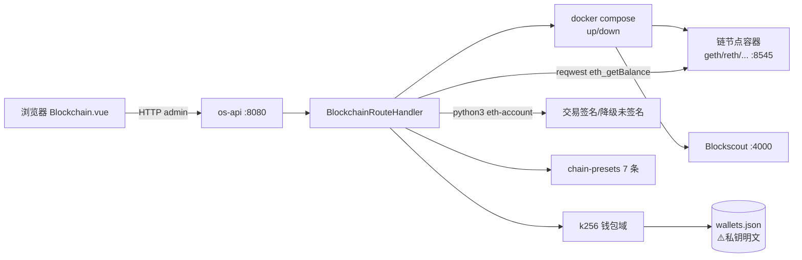

# 区块链管理（Blockchain）

> 源码：`crates/os-api/src/handlers/blockchain.rs`（`BlockchainRouteHandler`，组件名 `blockchain`，约 2,350 行）·
> 前端：`crates/os-api/web/src/views/Blockchain.vue`（路由 `/blockchain`，appRegistry id=`blockchain`）
> 登记：2026-08-20 · 路由表/预设/env 均从源码核实

## 1. 功能说明

桌面"区块链"应用的后端 REST 入口：**RPC 节点 + 区块链浏览器 + 钱包**三类资源的编排管理。

- **RPC 节点**：每个节点 = 一个 docker compose 项目。创建时按链预设生成 `docker-compose.yml` 并落盘到
  `data_dir`（默认 `/tank/blockchain/<id>`）；`POST .../start|stop` **真实 spawn** `docker compose up -d` /
  `docker compose down`（cwd=data_dir）。docker 未安装 / 权限不足 / compose 失败 → 节点 `status=error`
  降级，不 panic（blockchain.rs:947-951）。
- **区块链浏览器**：Blockscout 实例，关联某 RPC 节点（web 端口默认 4000，Postgres 默认 5432），
  同样走 docker compose 编排（工作目录 `/tank/blockchain/<explorer-id>`）。
- **钱包**：k256 + tiny-keccak **纯 Rust** 生成/导入 secp256k1 密钥对并派生 EVM 地址；余额查询经共享
  reqwest Client POST `eth_getBalance` JSON-RPC（30s 超时，节点离线 → 余额降级 null）；交易签名 spawn
  `python3 -c <eth-account 脚本>`，缺库时降级返回**未签名**交易构造（`signed:false` + `unsigned_tx`，
  blockchain.rs:569-591）。

## 2. 组件拓扑与数据流

```
浏览器 Blockchain.vue ──HTTP(admin)──▶ os-api 网关 ──▶ BlockchainRouteHandler
                                                      ┌──────┬──────────┬──────────┐
              ┌───────────────────────────────────────▼      ▼          ▼          ▼
              │                              节点/浏览器编排        钱包域            链预设/统计
              │                              NodeInstance       WalletRecord      chain_presets()
              │                              ExplorerInstance   （内存 + 落盘）     （7 条常量）
              │                                   │                │
   ┌──────────┼─────────────┐                   │                │
   ▼          ▼             ▼                   ▼                ▼
docker     docker        compose_yaml      mkdir + 写盘       k256+tiny-keccak
compose    compose        落盘 data_dir     /tank/blockchain/  纯 Rust 密钥对
up -d      down           docker-compose    <id>/docker-       生成/导入/派生地址
(cwd=       (同左)         .yml              compose.yml              │
data_dir)                                          │             ┌─────┴─────┐
   │                                               ▼             ▼           ▼
   ▼                                        ┌────────────── /tank/os-data/
geth/reth/erigon/                           │                 wallets.json
ganache/anvil/op-geth/                      │                 （私钥明文⚠️）
arbitrum-node 容器                          ▼
(RPC :8545 / WS :8546)              reqwest eth_getBalance ──▶ 区块链 RPC 节点
                                     （30s 超时，离线→null）    （容器内或远端）
Blockscout 浏览器(:4000) + Postgres(:5432)   python3 -c eth-account（交易签名，
                                              缺库降级 signed:false）
```

启动一个节点的数据流：`POST /nodes（按 chain-presets 补全 chain_type/chain_id/name）→
mkdir data_dir + 落盘 docker-compose.yml → POST /nodes/:id/start 真实 spawn
docker compose up -d → status=running|error（失败降级不 panic）`。
钱包数据流：`POST /wallets（k256 生成）| POST /wallets/:id/import（私钥→派生地址）→
内存 WalletRecord → spawn_blocking 落盘 wallets.json → API 响应一律经 wallet_view() 剥离私钥`。



## 3. 路由表（20 条，component="blockchain"）

| method | path | 鉴权 | 动作 |
|--------|------|------|------|
| GET | `/api/v1/blockchain/nodes` | 公开 | 列节点 |
| POST | `/api/v1/blockchain/nodes` | admin | 创建节点（构造 compose + start_cmd） |
| GET | `/api/v1/blockchain/nodes/:id` | 公开 | 节点详情（含 compose_yaml） |
| POST | `/api/v1/blockchain/nodes/:id/start` | admin | 真实 `docker compose up -d` |
| POST | `/api/v1/blockchain/nodes/:id/stop` | admin | 真实 `docker compose down` |
| DELETE | `/api/v1/blockchain/nodes/:id` | admin | 删节点 |
| GET | `/api/v1/blockchain/explorers` | 公开 | 列浏览器 |
| POST | `/api/v1/blockchain/explorers` | admin | 创建 Blockscout（关联 node_id） |
| DELETE | `/api/v1/blockchain/explorers/:id` | admin | 删浏览器 |
| POST | `/api/v1/blockchain/explorers/:id/start` | admin | 启动浏览器 |
| GET | `/api/v1/blockchain/chain-presets` | 公开 | **7 条链预设**（见 §3） |
| GET | `/api/v1/blockchain/stats` | 公开 | 聚合统计 |
| GET | `/api/v1/blockchain/clients` | 公开 | 支持的客户端列表 + 说明 |
| GET | `/api/v1/blockchain/wallets` | 公开 | 列钱包（**绝不返回私钥本体**） |
| POST | `/api/v1/blockchain/wallets` | admin | 创建钱包（纯 Rust 生成密钥对） |
| DELETE | `/api/v1/blockchain/wallets/:id` | admin | 删钱包 |
| GET | `/api/v1/blockchain/wallets/:id/balance` | 公开 | eth_getBalance（离线降级 null） |
| POST | `/api/v1/blockchain/wallets/:id/import` | admin | 导入私钥（k256 派生地址） |
| POST | `/api/v1/blockchain/wallets/:id/sign` | admin | 签名交易（spawn python3，缺库降级未签名） |
| GET | `/api/v1/blockchain/wallets/:id/address` | 公开 | 导出地址（含脱敏格式） |

## 4. 链预设（GET /chain-presets，7 条）

`chain_presets()`（blockchain.rs:663-721）返回 4 类（ethereum / dev / l2 / custom）共 7 条：

| chain_type | chain_id | network | 名称 | 推荐客户端 | 默认同步 |
|-----------|---------:|---------|------|-----------|---------|
| ethereum | 1 | mainnet | Ethereum 主网 | geth / reth / erigon | snap |
| ethereum | 11155111 | sepolia | Sepolia 测试网 | geth / reth | snap |
| dev | 1337 | dev | 本地开发链 | ganache / anvil | full |
| l2 | 10 | optimism | Optimism | op-geth | snap |
| l2 | 42161 | arbitrum | Arbitrum One | arbitrum-node | snap |
| l2 | 8453 | base | Base | op-geth | snap |
| custom | 0 | custom | 自定义私有链 | geth / reth | full |

节点默认端口：RPC 8545、WS 8546；浏览器 web 4000 / db 5432。

## 5. 数据存储

| 数据 | 存储 | 说明 |
|------|------|------|
| 节点 / 浏览器定义 | **内存**（Mutex） | 重启即丢 |
| **钱包（含私钥）** | `/tank/os-data/wallets.json`（`WALLETS_FILE` blockchain.rs:514，spawn_blocking 异步落盘） | ⚠️ 见 §6 风险 |
| docker-compose.yml | `data_dir/docker-compose.yml`（默认 `/tank/blockchain/<id>`） | 落盘保留 |

## 6. 环境变量

无专属 env（源码无 `env::var` 调用）。外部依赖：`docker`（含 compose 子命令）、`python3`（可选，
仅交易签名）、目标链节点在线（余额查询）。

## 7. 已知限制与风险

1. **⚠️ 私钥明文落盘（最重要风险）**：钱包私钥以**明文 hex** 存 `/tank/os-data/wallets.json`
   （`WalletRecord.private_key` 字段）。API 侧已做投影——响应里的 `Wallet` 视图只含 `has_private_key`
   布尔（`wallet_view()` 剥离，blockchain.rs:43-45），但**文件本身无加密、无权限收紧、会随备份外泄**。
   在加密落地前不要在该钱包存放真实资产（docs/FEATURE_SURVEY.md §1.2 已建议砍钱包功能）。
2. **签名依赖 python3 eth-account**：宿主机未装该库时"签名"端点实际返回未签名交易（`signed:false`），
   不是错误。
3. **节点/浏览器定义不持久**：重启后实例列表清空（docker 容器还在跑，但管理面丢失；compose 文件
   留在 `/tank/blockchain/` 可手动接管）。
4. **rpc 端口不校验冲突**：创建节点不检查 8545 等端口是否已被占用，需用户自行错开。
5. 交易签名为固定 gas 21000 / gasPrice 0 的演示构造（`WALLET_SIGN_SCRIPT`），非可配置完整交易。
