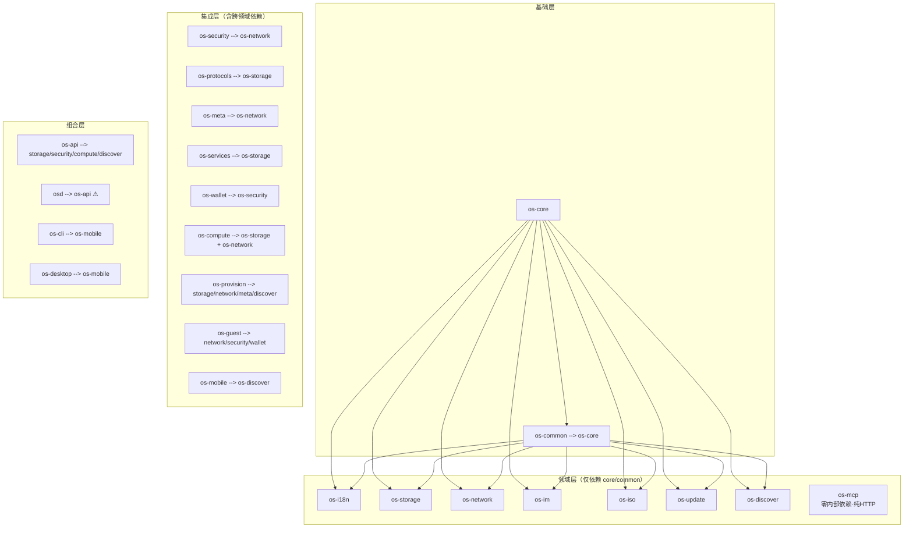

# 组件独立性审计报告（COMPONENT_INDEPENDENCE_AUDIT）

> 审计基线：main `fcd6077`，3949 测试全绿。
> 性质：**只读分析**，不改任何代码、不 commit。所有行号与结论均对应该 commit。
> 审计对象：workspace 26 个 crate（25 个 Cargo.toml + 1 个孤儿目录 `crates/os-web`），重点覆盖
> os-storage / os-im / os-network / os-security / os-wallet / os-compute / os-protocols / os-iso /
> os-mcp / os-i18n / os-common / os-core / osd / os-api（含 NexHub 两大 handler）。

---

## 1. 执行摘要

| 维度 | 结论 |
|------|------|
| **依赖健康度** | **无循环依赖**；分层清晰（core → common → 领域层 → 网关 → 守护进程）。唯一的"反向边"是 `osd → os-api`（守护进程组合网关，属组合根用法，但使 os-api 成为"库 + 28 个 handler 大杂烩"） |
| **接口边界** | 各领域 crate 一致遵守 Contract-First：trait 契约模块 + `mock` feature + `impl_*` 实现模块三件套，边界质量高。例外：os-api 的 handler 持有**具体类型**（`Arc<ZfsCliBackend>` / `Arc<LibvirtVmManager>`）而非 `dyn Trait`（文档已说明原因：原生 async fn in trait 不可 dyn） |
| **状态耦合** | handler 与 `GatewayState` **零耦合**（handler 只收 `ApiRequest`）；`GatewayState` 仅被 http.rs 装配层使用。这是本次审计最大的正面发现，直接决定了 NexHub 抽离的低成本 |
| **环境耦合** | `/tank` 绝对路径硬编码 22 处（os-api 为主）、双前缀环境变量（`NEXOS_*` / `OS_*` 并存）、`once_cell::Lazy` 全局 reqwest Client 5 处。均为 os-api 内部问题，领域 crate 基本干净 |
| **发布就绪度** | 元数据半就绪：version/license/description 全部经 workspace 继承（0.1.0 / MIT OR Apache-2.0）；但 **26 个 crate 全部缺 `repository` 字段、全部无 README**，仅 nettest 标了 `publish = false` |
| **NexHub 抽离** | **可行且成本低**（估计 0.5–1 人天）：两大 handler 对 os-api 的全部依赖只有 6 个类型 + 1 个函数调用点，测好的测试全部随文件走 |

**一句话结论**：这是一个"骨架纪律极好、发布纪律未起步"的 workspace。任何 crate 想真正独立发布，
共同的前置工作只有两件——`repository` 字段 + README；而 os-api 是唯一"不建议独立"的 crate，
它应继续作为组合根存在，但建议把 NexHub 抽成 `os-nexhub`、把网关契约 5 类型下沉 `os-common`。

---

## 2. 依赖图

### 2.1 完整内部依赖矩阵（运行时 [dependencies]）

| crate | 内部依赖 | 分层 |
|-------|---------|------|
| os-core | — | L0 |
| os-common | os-core | L1 |
| os-i18n | os-core, os-common | L2 |
| os-storage | os-core, os-common | L2 |
| os-network | os-core, os-common | L2 |
| os-im | os-core, os-common | L2 |
| os-iso | os-core, os-common | L2 |
| os-update | os-core, os-common | L2 |
| os-discover | os-core, os-common | L2 |
| os-mcp | **—（纯 HTTP 客户端，零内部依赖）** | L2* |
| os-security | os-core, os-common, **os-network** | L3 |
| os-protocols | os-core, os-common, **os-storage** | L3 |
| os-meta | os-core, os-common, os-network | L3 |
| os-services | os-core, os-common, os-storage | L3 |
| os-provision | os-core, os-common, os-storage, os-network, os-meta, os-discover | L3 |
| os-guest | os-core, os-common, os-network, os-security, os-wallet | L4 |
| os-wallet | os-core, os-common, **os-security** | L4 |
| os-compute | os-core, os-common, **os-storage, os-network** | L4 |
| os-mobile | os-core, os-common, os-discover | L3 |
| os-cli | os-core, os-common, os-discover, os-mobile | L4 |
| os-desktop | os-core, os-common, os-mobile | L4 |
| **os-api** | os-core, os-common, os-storage, os-security, os-compute, os-discover | L5 |
| **osd** | os-core, os-common, os-storage, os-compute, **os-api** | L6 |
| os-integration | —（dev-deps 引用全部 22 crate） | L7 |
| nettest | — | 边缘验证 crate |

\* os-mcp 与 os-api 的关系是**运行期 HTTP 协议**（默认 `http://127.0.0.1:8080`，`OS_API_URL` 覆盖），无编译期依赖——这是全仓耦合度最低的组件间通信范本。

### 2.2 Mermaid 依赖图



⚠ 标注边 = 全仓**唯一**一条"非客户端 crate 依赖 os-api"的边（见 §2.3）。

### 2.3 架构倒置检查

- **反向依赖 os-api 的 crate：仅 1 个 —— `osd`**（`crates/osd/src/main.rs:45-47`）。
  它导入 `os_api::gateway::Gateway`、`os_api::handlers::{ComputeRouteHandler, StorageRouteHandler, SystemRouteHandler}`、
  `os_api::{AuditMiddleware, AuthMiddleware, InProcessGateway, StatefulRateLimiter}`。
  性质判定：osd 是守护进程/组合根，复用 os-api 的 handler 目录本身说得通；**但它固化了一个架构事实——
  所有 handler 都长在 os-api 里**，领域 crate 无法自带自己的 RouteHandler 适配器。os-cli / os-desktop / os-mobile
  / os-integration 均不依赖 os-api（客户端走 HTTP 或 dev-dep），无倒置。
- **循环依赖：0 条**（对全图做 DFS 环检测，结果为空）。
- **os-integration** 以 dev-dependencies 引全部 22 个 crate，是刻意的端到端骨架，不算耦合问题，但决定了它永远不能独立。

---

## 3. 耦合质量分析

### 3.1 接口边界（trait 通信 vs 摸内部结构）

| crate | 契约 trait（通信面） | 实现模块 | mock | 评价 |
|-------|---------------------|---------|------|------|
| os-storage | `StorageBackend`（backend.rs） | `ZfsCliBackend` | ✅ `MockStorageBackend` | 干净；另导出 `parse_zpool_status` 等纯函数 |
| os-network | `backend`/`firewall`/`interface`/`rdma`/`dpu`/`services` 模块组 | `rtnetlink_real`/`nftnl_real`（FFI feature 门控） | ✅ | 干净；FFI 走 feature 隔离 |
| os-security | `auth`/`jwt`/`cert`/`vpn`/`totp` 全 trait 化 | `impls` | ✅ 5 个 Mock | 干净 |
| os-wallet | `ChainAdapter`/`WalletConnector`/`RpcRegistry` | `EvmAdapter`/`BitcoinAdapter` | ✅ | 干净 |
| os-compute | `VmManager`/`ContainerRuntime`/`PackageManager`/`ContainerNetwork` | `LibvirtVmManager`（默认内存态，`virt-ffi` 门控真实 libvirt） | ✅ | 干净 |
| os-protocols | `FileProtocol`/`ShareStore` + 各协议 Manager | webdav/ftp/sftp 真实后端 | ✅ | 干净 |
| os-iso | `Installer`/`IsoBuilder` | `RustInstaller`/`XorrisoIsoBuilder` | ✅ | 干净 |
| os-im | `Agent`/`ConversationStore`/`GroupManager`/`LlmBackend` 等 | `impls`/`*_impl` | ✅ | 干净 |
| os-i18n | `Translator`/`TranslationBundle` | `BundleTranslator` | ✅ | 干净 |
| os-mcp | `HttpBackend`（HTTP 传输抽象，可注入 StaticBackend 测试） | `ReqwestBackend` | ✅（trait 即 mock 点） | 干净 |
| os-api（handler→领域） | **持有具体类型** `Arc<ZfsCliBackend>`（storage.rs:58）、`Arc<LibvirtVmManager>`（compute.rs:126） | — | — | **例外**：原生 async fn in trait 不可 dyn，文档已声明（storage.rs:9-15）。是"编译期单态化"而非"摸内部结构"，但独立演进时 handler 与后端实现版本被锁死 |

**结论**：领域 crate 间 100% 经 trait 通信；唯一的边界瑕疵在 os-api handler 侧持有具体类型（有文档化的技术理由，可接受）。

### 3.2 状态耦合：GatewayState 与 handlers

`GatewayState`（`crates/os-api/src/http.rs:109-127`）四个字段：

| 字段 | 消费者 | handler 是否可见 |
|------|--------|----------------|
| `gateway: Arc<InProcessGateway>` | dispatch_handler / build_router | ❌ handler 只收 `ApiRequest` |
| `jwt: Option<Arc<JwtIssuerImpl>>` | extract_principal（鉴权中间件层） | ❌ |
| `admin_token: Option<Arc<String>>` | extract_principal + git_authenticate | ❌（经 `req.auth` 间接享受） |
| `git_repos_root: Option<String>` | **仅 git_http_handler（http.rs:719-722）** | ❌ |

**判定：handler 与 GatewayState 完全解耦**。`RouteHandler::handle(&self, req: ApiRequest)` 是唯一入口，
状态注入全部发生在 http.rs 装配层。这是抽离 NexHub 的核心有利条件。

### 3.3 NexHub 两大 handler 对 os-api 内部的依赖点（逐条清单）

**code_repo.rs（1461 行，22 个单测）的全部 os-api 依赖：**

| # | 依赖点 | 位置 | 性质 |
|---|--------|------|------|
| 1 | `crate::error::ApiGatewayError` | code_repo.rs:39 | 类型 |
| 2 | `crate::gateway::{ApiRequest, ApiResponse, HttpMethod, RouteHandler, RouteSpec}` | code_repo.rs:40 | 5 个类型 |
| 3 | 被 http.rs 反向引用：`crate::handlers::code_repo::repos_dir` 作 git CGI 的仓库根回退 | http.rs:722 + 文档 :123 | 1 个函数 |
| 4 | `build_clone_url_http` 生成的 URL 指向 http.rs 的 `/git/{*path}` 路由 | code_repo.rs:98,110-117 | URL 字符串契约（非代码） |
| 5 | main.rs 注册：`gw.register_component("code_repo", Box::new(CodeRepoRouteHandler::new()))` | main.rs:465-467 | 3 行装配 |
| 6 | handlers/mod.rs 的 `pub mod code_repo` + `pub use` | mod.rs:63,92 | 2 行 |

其余全部自足：git 操作走 `tokio::process::Command` spawn 系统 git；DTO/解析函数全部本地；
`spec`/`path_segments`/`query_params` helper 是每个 handler 各自私有的本地副本（非共享内部）。

**nexhub_lobby.rs（1482 行，19 个单测）的全部 os-api 依赖：**

| # | 依赖点 | 位置 | 性质 |
|---|--------|------|------|
| 1 | `crate::error::ApiGatewayError` | nexhub_lobby.rs:44 | 类型 |
| 2 | `crate::gateway::{ApiRequest, ApiResponse, HttpMethod, RouteHandler, RouteSpec}` | nexhub_lobby.rs:45 | 同上 5 类型 |
| 3 | `crate::handlers::code_repo::{build_clone_url, build_clone_url_http, repos_dir}` | nexhub_lobby.rs:47 | **3 个 pub 函数（对 code_repo 的横向依赖，随迁即消）** |
| 4 | main.rs 注册 | main.rs:472-474 | 3 行 |
| 5 | handlers/mod.rs 声明 | mod.rs:75,104 | 2 行 |

**webui 静态资源侧的软耦合**（不阻塞抽离，但需登记）：
`crates/os-api/web/src/views/CodeHub.vue`、`api/client.ts`（:821-848 coderepo 全套方法）、
`router/index.ts`、`appRegistry.ts` 调用 `/api/v1/coderepo/*` 与 `/api/v1/nexhub/lobby/*`。
这是 HTTP 契约耦合，URL 不变则前端零改动；vue 产物经 rust-embed 编译进 os-api binary，与 handler 代码无编译期关系。

### 3.4 对环境 / 全局的依赖

**`/tank` 绝对路径（生产代码，非测试 fixture）：**

| 位置 | 内容 | 可覆盖 |
|------|------|--------|
| code_repo.rs:50 | `/tank/git-repos`（裸仓库根） | `NEXOS_GIT_REPOS_DIR` / `OS_GIT_REPOS_DIR` |
| nexhub_lobby.rs:754 | `/tank/os-data/hub_lobby.db` → `/var/lib/os/` → `./` 三级回退 | 无 env（构造注入 `with_db_path`） |
| api_gateway.rs:1730 | `/tank/os-data/gateway.db` 同模式 | 构造注入 |
| im.rs:1007 / media.rs:1249 | `/tank/os-data/im.db` / `media.db` 同模式 | 构造注入 |
| blockchain.rs:517 | `const WALLETS_FILE = "/tank/os-data/wallets.json"`（**const 硬编码，无覆盖**） | ❌ |
| ble_hub.rs:915 | `/tank/os-data` | — |
| files.rs:379-392 / notes.rs:114 | 运行期探测 `/tank` 是否存在选根 | ❌（探测式） |
| os-protocols nfs/smb 等 | 全部在 `#[cfg(test)]` fixture 内，非生产 | — |

**环境变量（os-api 生产代码 14 处）**：`NEXOS_ADMIN_TOKEN`/`OS_ADMIN_TOKEN`（osd:246 + git 鉴权）、
`NEXOS_GIT_REPOS_DIR`/`OS_GIT_REPOS_DIR`、`NEXOS_GIT_USER`/`OS_GIT_USER`、`NEXOS_GIT_HOST`/`OS_GIT_HOST`、
`NEXOS_HTTP_PORT`/`OS_HTTP_PORT`。双前缀回退（先 NEXOS_ 后 OS_）是统一模式但属命名债。
领域 crate 侧仅 5 处且多为测试门控（`OS_TEST_VDEV`、`OS_RDMA_SKIP_PROBE`、`OS_CLIP_MODEL_DIR`、`OS_API_URL`）。

**全局缓存**：`OnceLock`/`once_cell::Lazy` 共 12 处——code_repo 的 `cached_hostname()`（OnceLock），
system.rs 的启动时刻缓存，以及 media/llm/downloads/blockchain/api_gateway 5 个 handler 各自的
`static HTTP: Lazy<reqwest::Client>`（连接池复用，进程级单例；抽离 NexHub 时只有 cached_hostname 需随迁）。

---

## 4. 独立发布就绪度（每个主要组件一行）

| 组件 | license | description | repository | README | 版本 | 测试可脱离主仓跑 |
|------|---------|-------------|------------|--------|------|------------------|
| os-core | ✅ workspace | ✅ | ❌ | ❌ | 0.1.0 workspace | ✅ 纯逻辑，零内部依赖 |
| os-common | ✅ | ✅ | ❌ | ❌ | 0.1.0 | ✅ |
| os-i18n | ✅ | ✅ | ❌ | ❌ | 0.1.0 | ✅（toml 解析 + 内存 bundle） |
| os-storage | ✅ | ✅ | ❌ | ❌ | 0.1.0 | ✅ mock 后端全覆盖；真实 zfs 测试走 CLI/门控 |
| os-network | ✅ | ✅ | ❌ | ❌ | 0.1.0 | ✅（nftnl FFI feature 门控，默认不编译） |
| os-im | ✅ | ✅ | ❌ | ❌ | 0.1.0 | ✅ |
| os-security | ✅ | ✅ | ❌ | ❌ | 0.1.0 | ✅ |
| os-wallet | ✅ | ✅ | ❌ | ❌ | 0.1.0 | ✅（外部 RPC 走 mock registry） |
| os-compute | ✅ | ✅ | ❌ | ❌ | 0.1.0 | ✅（virt-ffi 门控，默认内存态） |
| os-protocols | ✅ | ✅ | ❌ | ❌ | 0.1.0 | ✅（dav/ftp 内存后端 + memfs） |
| os-iso | ✅ | ✅ | ❌ | ❌ | 0.1.0 | ✅（xorriso 缺失降级不 panic） |
| os-mcp | ✅ | ✅ | ❌ | ❌（根 Cargo.toml 注释提过 `crates/os-mcp/README`，**实际不存在**） | 0.1.0 | ✅（StaticBackend 注入式测试，零内部依赖） |
| osd | ✅ | ✅ | ❌ | ❌ | 0.1.0 | ✅（systemd/cgroup 真实测有环境门控） |
| os-api | ✅ | ✅ | ❌ | ❌ | 0.1.0 | ⚠ 需系统 `git` 二进制（code_repo/nexhub 真实 git 测试）；webui 需 `make web` 产物（缺产物仍可编译启动，走 Legacy 兜底） |

共性缺口：**`repository` 字段全仓 0/26；README 全仓 0/26；除 nettest 外均未标 `publish = false`**
（即名义上可发布到 crates.io，但路径依赖 `os-core = { path = ... }` 使其实际不可发布——独立时必须换成
version 依赖或 git 依赖）。版本策略为统一 workspace 0.1.0（✅ 一致，独立时需各自定版或发布 `os-common`/`os-core` 为锚）。

---

## 5. 结论分级

| 组件 | 评级 | 理由 / 需要的改动 |
|------|------|-------------------|
| **os-core** | **A 可直接独立** | 零内部依赖，纯类型 + EventBus，测试自足。补 repository + README 即可 |
| **os-common** | **A** | 仅依赖 os-core（需连带或发布 os-core 为版本依赖） |
| **os-i18n** | **A** | 仅 core/common；自带 TOML 子集解析 + 完整测试 |
| **os-mcp** | **A** | **全仓最干净**：零内部依赖，经 HTTP + `HttpBackend` trait 与 os-api 解耦，`OS_API_URL` 可指向任意网关。可立即独立仓库维护 |
| **os-storage** | **A** | 仅 core/common；真实层是 zfs CLI 子进程，不引入 FFI；mock 测试自足 |
| **os-network** | **A**（附注） | 仅 core/common；rtnetlink 纯 Rust，nftnl FFI 已 feature 门控。附注：独立后需自带 deny.toml/CI 的 FFI 安装说明 |
| **os-im** | **A** | 仅 core/common，无 LLM 外部服务硬依赖（LlmBackend trait + mock） |
| **os-iso** | **A** | 仅 core/common；xorriso 缺失降级 |
| **os-update** | **A** | 仅 core/common（未列重点，顺带审计） |
| **os-discover** | **A** | 仅 core/common |
| **os-security** | **B 小改可独立** | 依赖 os-network（防火墙/接口类型）。改动点：抽出网络相关 2–3 个类型到 os-common，或连带 os-network 一起迁。工作量 **0.5 天**（含验证） |
| **os-wallet** | **B** | 依赖 os-security（Principal/JWT 场景）。改动点同上——安全身份类型下沉 os-common 后即可独立。工作量 **0.5–1 天** |
| **os-protocols** | **B** | 依赖 os-storage 的 Share/path 模型（约 5 个类型）。改动点：把 `ShareOptions`/路径模型抽到 os-common，或连 os-storage 同迁。工作量 **1 天** |
| **os-compute** | **B** | 依赖 os-storage + os-network（卷/网络附着模型，约 8 个类型）。工作量 **1 天** |
| **os-meta / os-provision / os-guest / os-services** | **B**（顺带审计） | 各有 1–4 个领域横向依赖，同模式处理 |
| **os-cli / os-desktop / os-mobile** | **B** | 客户端族，依赖链 mobile→discover；独立价值中等（见 §7 路线） |
| **os-api** | **C 建议留内部** | 组合根：28 个 handler 目录 + GatewayState + webui 内嵌 + `/tank` 默认值 + `/git/*` CGI 装配全在此。独立它等于独立整个 OS。正确演进方向是**瘦身**（NexHub 抽出 + 契约下沉），而非独立 |
| **osd** | **C** | 守护进程，定义上就是组合点（依赖 os-api 装配网关）；独立无意义。它的存在恰恰说明 os-api 需要保留"handler 目录"角色或完成 §7.3 的下沉 |
| **os-integration** | **C** | dev-deps 全部 22 crate 的端到端骨架，天然 workspace 绑定 |

---

## 6. NexHub 独立化专项（code_repo.rs + nexhub_lobby.rs → `os-nexhub`）

### 6.1 可行性判定：**高，建议执行**

两大 handler 合计 **2943 行（含 41 个单测）**，对 os-api 的编译期依赖收敛为
**6 个类型（ApiGatewayError + gateway 5 类型）+ 1 个回退函数调用（http.rs:722）**。
不存在 GatewayState 依赖、不存在中间件依赖、不存在 webui 编译期依赖。测试全部用 tempdir/内存库隔离，
随文件迁移即自足（唯一外部要求：PATH 里有 `git` 二进制——现状即如此）。

### 6.2 RouteHandler trait 的位置与下沉方案

- 现状：`RouteHandler`（async_trait，dyn 兼容）定义于 `crates/os-api/src/gateway.rs:102`，
  同文件还有 `Gateway` trait + `HttpMethod/RouteSpec/ApiRequest/ApiResponse/TlsConfig`。
- **能否放 os-common？能，且是正确归宿**。阻碍只有一个：`RouteHandler::handle` 返回
  `Result<ApiResponse, crate::ApiGatewayError>`，而 `ApiGatewayError`（error.rs:43）含
  `From<rusqlite::Error>`——直接搬会让 os-common 强依赖 rusqlite。
- 推荐三选一（按代价升序）：
  1. **错误泛型化（推荐）**：`trait RouteHandler { async fn handle(&self, req: ApiRequest) -> Result<ApiResponse, HandlerError>; }`，
     `HandlerError` 是 os-common 新建的轻量错误（Unauthorized/Internal/…，不含 rusqlite From）。
     os-api 的 `ApiGatewayError` 加 `From<HandlerError>` 保持外部行为不变。
  2. feature 门控：os-common 加 `rusqlite` optional feature 承载那个 From impl（引入条件编译债，不推荐）。
  3. 保守版：新建 `os-gateway-contract` 微 crate 只装 6 类型（多一个 crate 的维护成本）。
- os-api 侧 `pub use os_common::{RouteHandler, ApiRequest, ...}` 原位再导出，**其余 26 个 handler 零改动**。

### 6.3 git HTTP 路由（http.rs `/git/*`）与 handler 的耦合分析

耦合是**单向且只有一根线**：

```
build_router (http.rs:827)  route("/git/{*path}", git_http_handler)
   └─ git_http_handler (http.rs:678)
        ├─ git_authenticate(state.admin_token / jwt)   ← GatewayState（留在 os-api，合理）
        ├─ state.git_repos_root 回退 crate::handlers::code_repo::repos_dir()  ← 唯一 import 级耦合（http.rs:722）
        └─ spawn git-http-backend（CGI 协议，与 handler 无代码共享）
```

code_repo 对 `/git/*` 的依赖只是**生成的 URL 字符串**（`http://host:port/git/<name>.git`）——协议契约而非代码契约。
因此有两个抽法：

- **方案甲（最小改动，推荐先做）**：git CGI 块（http.rs:384-799，约 416 行：`parse_git_path`/
  `build_cgi_env`/`parse_cgi_output`/`git_authenticate`/`git_http_handler` 等 + 常量）**留在 os-api**，
  仅把 http.rs:722 的 `crate::handlers::code_repo::repos_dir` 改为 `os_nexhub::repos_dir`。
  鉴权（admin_token）本就属于网关职责，不动。
- **方案乙（彻底）**：git CGI 块随迁 os-nexhub，暴露 `os_nexhub::git_http_router(repos_root: Option<String>, auth: GitAuthConfig) -> axum::Router`，
  os-api 的 `build_router` 里 `router = router.merge(os_nexhub::git_http_router(...))`。代价是 os-nexhub
  要依赖 axum 且鉴权回调需要跨 crate 抽象（约 +40 行接口代码）。**建议二期再做**。

### 6.4 搬迁清单与工作量估计

| 步骤 | 内容 | 行数估计 |
|------|------|---------|
| 1 | 新建 `crates/os-nexhub`：Cargo.toml（deps: tokio/async-trait/serde/serde_json/thiserror/rusqlite/os-core/os-common）+ lib.rs（`pub mod code_repo; pub mod nexhub_lobby; pub use ...`） | ~60 行新写 |
| 2 | `git mv` 两个 handler 文件，改 2 处 import：`crate::error::ApiGatewayError` / `crate::gateway::{...}` → `os_common::...`（或暂改 `os_api::...` 若走零契约下沉的快路径：os-nexhub 直接依赖 os-api 则完全零改动，但形成新的倒置边，**不推荐**） | ~4 行改 |
| 3 | http.rs:722 回退函数改指向 `os_nexhub::repos_dir` | 1 行改 |
| 4 | handlers/mod.rs 删 2 个 mod + 2 个 pub use；main.rs 改 2 处 import + 保持 register_component 调用（类型未改名，`CodeRepoRouteHandler::new()` 不变） | ~6 行改 |
| 5 | os-api Cargo.toml 加 `os-nexhub.workspace = true`；根 Cargo.toml members + workspace.dependencies 各加 1 行 | 3 行改 |
| 6 | os-api lib.rs 文档注释更新（`handlers` 模块清单） | ~5 行 |
| 7 | 回归：`cargo test -p os-nexhub -p os-api`（41 个随迁测试 + http.rs 的 ~20 个 git 路由测试原地不动） | — |

**合计：净迁移约 2950 行（其中机械移动 ~2900，真正新写/改写 ~120 行）；工作量 0.5–1 人天**（含全量回归）。

### 6.5 抽离后 os-api 如何注册它

与现状完全同构（main.rs:465-474 模式不变）：

```rust
use os_nexhub::{CodeRepoRouteHandler, NexHubLobbyRouteHandler};

gw.register_component("code_repo", Box::new(CodeRepoRouteHandler::new()))
    .await.expect("注册 code_repo handler");
gw.register_component("nexhub-lobby", Box::new(NexHubLobbyRouteHandler::new()))
    .await.expect("注册 nexhub-lobby handler");
```

运行期契约零变化：路由路径（`/api/v1/coderepo/*`、`/api/v1/nexhub/lobby/*`、`/git/*`）、
环境变量（`NEXOS_GIT_REPOS_DIR` 等）、DB 路径（`/tank/os-data/hub_lobby.db`）、
webui（CodeHub.vue 走 HTTP，不受影响）全部保持原样。

### 6.6 风险与注意点

1. **`env::set_var` 测试竞态**：code_repo.rs:1155-1373 的测试通过改全局 env 隔离仓库根，迁移后与其他
   crate 并行测试（`--test-threads` 跨 crate 本就串行进程，风险不变），建议后续改成构造注入（`with_repos_dir` 已支持）。
2. `GatewayState.git_repos_root` 注入点留在 os-api（http.rs:126），语义是"测试隔离覆盖"，抽离后依然有效。
3. workspace 注释 `crates/os-mcp/README`（根 Cargo.toml members 注释）与实际文件不符——同类文档债在抽 crate 时注意别再产生。

---

## 7. 建议路线

| 阶段 | 动作 | 理由 | 工作量 |
|------|------|------|--------|
| **P0（发布纪律，全仓一次性）** | 26 个 Cargo.toml 补 `repository` 字段；每个 crate 加最小 README（一段定位 + 测试命令）；暂不打算发 crates.io 的补 `publish = false` | 任何独立化（含 NexHub）的公共前置；纯元数据，零编译影响 | 0.5 天 |
| **P1（NexHub 抽离，本报告主推）** | 按 §6.4 执行 `os-nexhub` 抽离（方案甲） | 依赖面最小（6 类型 + 1 函数）、测试随迁自足、运行期契约零变化 | 0.5–1 天 |
| **P2（契约下沉）** | `RouteHandler` + `ApiRequest/ApiResponse/RouteSpec/HttpMethod/HandlerError` 下沉 os-common（§6.2 方案 1），os-api 原位 re-export | 消除"handler 必须长在 os-api"的结构性约束，为"领域 crate 自带 RouteHandler"铺路；也是 os-security/wallet/protocols/compute 四个 B 级组件独立化的共同前置 | 1–2 天 |
| **P3（环境收敛）** | `/tank/*` 默认路径收敛为 os-common 单一 `paths` 模块（含 blockchain.rs:517 的 const 与 files.rs 的探测式选根）；环境变量统一 `NEXOS_` 前缀（保留 `OS_` 回退一个版本周期） | 22 处散落默认值是独立部署时最大的行为漂移源 | 1 天 |
| **不做** | os-api / osd / os-integration 的独立化 | 组合根与端到端骨架，独立收益为负 | — |

**优先级排序依据**：P0 是所有路径的分母；P1 已具备全部条件且立刻减薄 os-api（-2943 行，约 -6%）；
P2 解锁 B 级组件；P3 在组件真正"离开本机部署"前完成即可。

---

## 附录：审计方法与证据索引

- 依赖矩阵：解析根 Cargo.toml members + 各 crate `[dependencies]`/`[dev-dependencies]` 中的内部 crate 键（含 `xxx.workspace = true` 形式），DFS 环检测为空。
- 耦合点均给出文件:行号：GatewayState（http.rs:109）、RouteHandler（gateway.rs:102）、git_http_handler（http.rs:678）、build_router 的 /git 挂载（http.rs:827）、repos_dir 回退（http.rs:722）、code_repo env（code_repo.rs:50）、nexhub DB 路径（nexhub_lobby.rs:753-762）、osd 导入（osd/src/main.rs:45-47）、main.rs 注册（main.rs:465-474）。
- `/tank` 与 env 扫描：`grep -rn '"/tank'` 与 `grep -rn "env::var"` 全仓，区分生产代码与 `#[cfg(test)]` fixture。
- 元数据审计：26 个 Cargo.toml 逐个检查 license/description/repository/version.workspace/publish 与 README 存在性。
- 测试量：全仓 `#[test]`/`#[tokio::test]` 共约 4154 个标注（含 #[ignore]），基线 3949 全绿。
