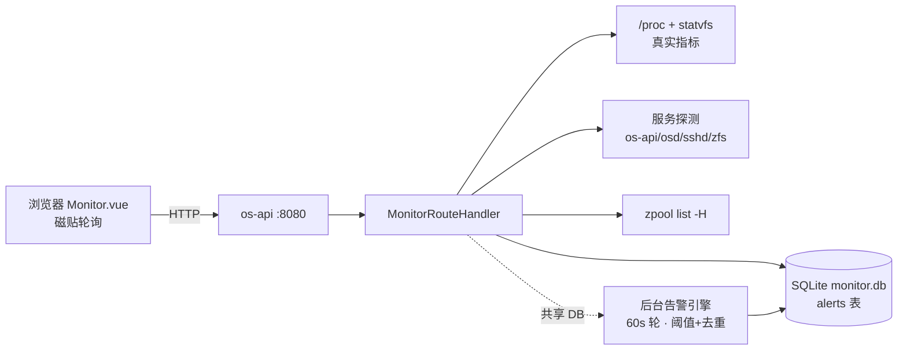

# 系统监控（Monitor）

> 源码：`crates/os-api/src/handlers/monitor.rs`（`MonitorRouteHandler`，组件名 `monitor`）·
> 前端：`crates/os-api/web/src/views/Monitor.vue`（路由 `/monitor`，appRegistry id=`monitor`，675 行）
> 登记：2026-08-20 · 路由表/数据源/DB 路径均从源码核实 · 2026-09-24 增 vraminfo 显存采集节

## 1. 功能说明

桌面"系统监控"应用的后端 REST 入口：**真实系统指标读取 + SQLite 持久化告警 + 阈值规则引擎**。

- **系统指标**：`spawn_blocking` 真实读 `/proc/loadavg`、`/proc/meminfo`、`/proc/stat`（两次采样算
  CPU 使用率，状态存 `last_cpu`）、`/proc/net/dev`、`/proc/uptime`、`statvfs`（磁盘）、
  `/proc/sys/kernel/osrelease`、数 `/proc/[pid]`（进程数）。单项失败回退保守值，不拉垮聚合
  （monitor.rs 模块文档"当前实现策略"）。
- **服务状态**：探测 `os-api` / `osd` / `sshd` / `zfs` 进程是否在跑（扫 `/proc` cmdline 或 pgrep），
  失败回退 `unknown`。
- **告警**：SQLite 持久化（`alerts` 表，首建 seed 2 条示例）；`GET /alerts` 查最近 100 条倒序，
  `POST /alerts/:id/ack` 置 `acked=1`。
- **阈值规则引擎**：后台 tokio task（`spawn_alert_engine`），**60 秒一轮**——拉真实指标 + 服务状态，
  套 `check_thresholds` 纯函数（CPU/内存/磁盘）+ 服务停止探测；命中且**同 source+level 5 分钟内未
  重复**才 INSERT 告警（去重防风暴）。
- **历史**（`/history`）：**占位示例数据**（若干时间点 CPU/内存采样），尚未接真实采样落库。
- **ZFS 池**（`/zpools`）：真实 `zpool list -H`，失败降级为示例。
- **GPU 显存**（`/vram`，v0.1.50）：vraminfo 探测式采集——显存颗粒厂商/类型（NVAPI）+
  显存结温（MMIO 直读，`nvidia-smi` 在 Linux 不提供），见 §1.1。

### 1.1 GPU 显存采集（`/vram` + vraminfo，v0.1.50）

**工具**：[vraminfo](https://github.com/xzwgit/vraminfo)（MIT 单文件 C，无第三方依赖）——NexHub
仓 `vraminfo`（`/tank/git-repos/vraminfo.git`，tag **`v1.0.0-nexos`**，README 附本节同款
集成契约）。安装：`git clone /tank/git-repos/vraminfo.git && cd vraminfo && make && sudo make install`
（装到 `/usr/local/bin/vraminfo`）。

**温度读数的 root 要求（提权自适应）**：GDDR6X/7 结温从 `/dev/mem` 只读映射取，需 root：

| os-api 部署形态 | exec 方式 |
|---|---|
| 以 root 跑 | 直接 exec |
| 非 root（106 `User=oem`） | 先 `sudo -n <bin> --json --per-module`（NOPASSWD 免交互；106 已配 `/etc/sudoers.d/nexos-vraminfo`：`oem ALL=(root) NOPASSWD: /usr/local/bin/vraminfo`——仅授权 vraminfo 本体，不放大权限） |
| sudo 层失败（未装/未授权/需密码） | 回落直接 exec，如实保留非 root 的 note 降级（`open(/dev/mem) failed … run as root`），不报错不告警 |

sudo 层失败 vs 工具自身失败的判定：仅 sudo 前缀报错（`sudo:` 开头 / `a password is required` /
sudo 未安装）才回落；工具回执（如 `no NVIDIA GPU found`）是真实结果，不回落。

**探测契约**（probe_utils.rs ffmpeg/blender 同款"探测到才用、探测不到静默降级"，Cargo 零依赖）：

| 态 | 判定 | 端点表现 |
|---|---|---|
| 显式覆写 | env `NEXOS_VRAMINFO_BIN` 指向可执行文件 | 直接用 |
| PATH 发现 | PATH 目录扫描 → 常规落点（`/usr/local/bin`、`/usr/bin`） | 命中即用 |
| 缺失 | 以上全不中 | `{available:false, hint:<安装指引>}`（200 降级，不报错） |

**采集**：单次 exec `vraminfo --json --per-module`（两 flag 合并，一次拿全热点 + 逐颗粒
温度；GDDR7 才有逐颗粒测点），**5s 超时**；结果**缓存 10s**（handler 内存态 `vram_cache`，
监控页轮询与后台告警引擎共享同一份缓存，不重复 spawn）。响应
`{available, bin, gpus:[{bdf, board_vendor, memory_maker, memory_type, memory_temp_c,
memory_temp_modules_c?, note}], error?, age_secs}`。

**降级矩阵**（诚实边界——note 各形态原样透传，由人判断）：

| 工具侧状态 | 端点表现 | 告警 |
|---|---|---|
| 温度可读（`note:null`） | `memory_temp_c` 数值 | 见下阈值规则 |
| 无传感器（note 含 `no memory temperature sensor`；GDDR6/GDDR5 硬件属性，如 3060/CMP 50HX） | 温度 null + note 透传，前端显示"无温度传感器" | **不告警** |
| 非 root（`open(/dev/mem) failed … run as root`） | note 透传 | 不告警 |
| 内核策略（`MMIO read failed (try iomem=relaxed)`） | note 透传 | 不告警 |
| 无 NVIDIA GPU / 超时 / 输出不可解析 | `available:true` + `gpus:[]` + `error` | 不告警 |

**告警规则**（接入既有阈值规则引擎 60s 轮，source=`vram`）：全场最热卡
`memory_temp_c ≥ NEXOS_VRAM_TEMP_WARN`（缺省 **100°C**，长期运行建议上限）→ warning；
`≥ NEXOS_VRAM_TEMP_CRIT`（缺省 **110°C**，GDDR6X/7 硬件降频/保护点）→ critical；
每轮至多一条（更高严重度覆盖），引擎同 source+level 5 分钟去重照常生效。

### 统一内存节点（DGX Spark GB10 等，2026-09-03）

GB10/Jetson 类超芯片 CPU/GPU **共享同一 LPDDR5x 内存池**（Spark 实测
MemTotal 127600528 kB ≈ 121.7 GiB），无独立显存——本页内存磁贴读的
`/proc/meminfo` **就是 GPU 可用内存的全部真相**（vLLM 占的也是它）。
`read_meminfo` 因此成为全仓统一内存回退的单一数据源（llm.rs GPU 探测 /
api_market.rs server_config / media_gen.rs 显存闸门共用，口径一致：
used = MemTotal − MemAvailable）。监控页在 Spark 上无需任何改动即真实有效
（实测：121Gi 总量、15Gi swap、3.7T NVMe 根分区 16% 用量均正确上报）。

### 前端磁贴与数据源对应（Monitor.vue）

| 磁贴 | 数据源端点 |
|------|-----------|
| CPU / 内存 / 磁盘 百分比进度条 | `GET /metrics`（`cpu_usage` / `mem_*` / `disk_*`） |
| 负载（1/5/15min）、网卡 ↓↑ | `GET /metrics`（`load_avg` / `net_rx_bytes` / `net_tx_bytes`） |
| GPU 显存卡（厂商/类型徽章 + 结温着色 + 逐颗粒迷你条，i18n ×4） | `GET /vram`（admin；降级矩阵见 §1.1） |
| 服务状态卡 | `GET /services`（running/stopped/unknown + pid） |
| 未确认告警列表 + ack 按钮 | `GET /alerts` + `POST /alerts/:id/ack` |
| ZFS 池健康卡 | `GET /zpools`（state ONLINE 判 healthy） |

## 2. 组件拓扑与数据流

```
浏览器 Monitor.vue（磁贴 5s 轮询）
   │  GET /api/v1/monitor/{metrics,services,alerts,zpools,stats,vram}
   ▼
os-api 网关 ──▶ MonitorRouteHandler ──────────────────────────────────────┐
                    │                                                    │
     ┌──────────────┼───────────────────┬──────────────┐                 ▼
     ▼              ▼                   ▼              ▼                 ▼
 spawn_blocking   服务探测          SQLite alerts 表   zpool list -H   后台 tokio task
 读 /proc/*        os-api/osd/       （monitor.db）    （失败降级       spawn_alert_engine
 loadavg/meminfo  sshd/zfs 进程       │                示例数据）       60 秒一轮：
 /stat×2 采样      （/proc cmdline    │                                  拉指标+服务状态
 算 CPU%           或 pgrep）          │                                  → check_thresholds
 /net/dev/uptime                      │                                  → vraminfo 显存温度
 statvfs 磁盘                          ▼                                  → 命中且 5 分钟内
 /proc/[pid] 计数            首建表 + seed 2 条示例告警                    同源未重复 → INSERT
                                     POST /alerts/:id/ack → acked=1       告警

vraminfo exec（--json --per-module，5s 超时，10s 缓存）──── /vram 端点与告警引擎共用 ────┘
```

告警生命周期数据流：`后台引擎 60s 采样 → 阈值命中（cpu/memory/disk）或服务停止（source=service）
→ 去重判定（同 source+level 5 分钟窗口）→ INSERT alerts(level,message,source) →
前端未确认磁贴 → 用户 ack → acked=1`。



> 与进程级 `/metrics`（OTel/Prometheus，DEPLOYMENT.md §8）互补：本应用面向"人看磁贴 + 告警"，
> `/metrics` 面向 Prometheus 抓取。

## 3. 路由表（9 条，component="monitor"）

| method | path | 鉴权 | 动作 |
|--------|------|------|------|
| GET | `/api/v1/monitor/metrics` | 公开 | 系统指标（真实 /proc 读取） |
| GET | `/api/v1/monitor/net-rate` | 公开 | 实时网速（两次 /proc/net/dev 差值） |
| GET | `/api/v1/monitor/services` | 公开 | 服务状态（探测进程） |
| GET | `/api/v1/monitor/alerts` | 公开 | 告警列表（SQLite，最近 100 条） |
| POST | `/api/v1/monitor/alerts/:id/ack` | admin | 确认告警 |
| GET | `/api/v1/monitor/history` | 公开 | 历史采样（**占位示例**） |
| GET | `/api/v1/monitor/zpools` | 公开 | ZFS 池状态（真实 zpool list，失败降级示例） |
| GET | `/api/v1/monitor/stats` | 公开 | 聚合摘要 |
| GET | `/api/v1/monitor/vram` | admin | GPU 显存厂商/类型/结温（vraminfo 探测式，v0.1.50，见 §1.1） |

## 4. 数据存储

| 数据 | 存储 | 说明 |
|------|------|------|
| 告警 | SQLite `alerts` 表 | 路径优先级：`/tank/os-data/monitor.db` → `/var/lib/os/monitor.db` → `./monitor.db`（monitor.rs:497-508）；仓库根的 `monitor.db` 即最后的保底落点 |
| CPU 上次采样 | 内存（`last_cpu`） | 用于两采样点差值算 CPU%，重启后首轮无值 |
| 显存采集缓存 | 内存（`vram_cache`，TTL 10s） | `/vram` 端点与告警引擎共享；重启即失效重采 |
| 阈值规则 | 代码内固定阈值（`check_thresholds`） | CPU/内存/磁盘不可经 API 配置；显存阈值走 env（§5） |

告警字段：`id / level(info|warning|critical) / message / source(cpu|memory|disk|service|vram) / timestamp / acked`。

## 5. 环境变量

| env | 缺省 | 作用（v0.1.50 起） |
|-----|------|------|
| `NEXOS_VRAMINFO_BIN` | — | vraminfo 显式路径覆写（探测链首位；可执行才认） |
| `NEXOS_VRAM_TEMP_WARN` | `100` | 显存温度 warning 阈值（°C；非数字/超 40..=150 回落缺省） |
| `NEXOS_VRAM_TEMP_CRIT` | `110` | 显存温度 critical 阈值（°C；warn>crit 时 crit 抬到 warn） |

DB 路径由目录存在性探测决定（见 §4），不用 env。

## 6. 已知限制

1. **`/history` 是占位示例数据**——历史采样尚未落库（alerts 表模式现成，FEATURE_SURVEY 列为 1 天量级
   优化项）。
2. **阈值不可配置**：CPU/内存/磁盘阈值硬编码在 `check_thresholds`，修改需改代码（显存阈值自
   v0.1.50 起可走 env，见 §5）。
3. **告警只进 DB 不推送**：无 IM/WebSocket 通知通道（规划中监控告警接 IM，见 DEPLOYMENT.md §8.5）。
4. `/zpools` 降级示例数据与真实数据形状一致，前端无法区分（无 `demo` 标记）。
5. 与进程级 `/metrics`（OTel Prometheus 端点，见 DEPLOYMENT.md §8）是**两套监控**：本页为业务监控
   应用（/proc 指标 + 告警 DB），`/metrics` 为网关进程级 OTel 指标。
6. `/vram` 前端阈值**着色**固定按 100/110（`VRAM_TEMP_WARN/CRIT` 常量），不随 env 变——env 只
   调后端**告警**阈值；如需完全一致再让端点回传生效阈值（v0.1.50 未做）。
7. `/vram` 的 GPU 明细来自 vraminfo 单次 exec 快照，**不含** nvidia-smi 的利用率/显存占用——
   那部分在 llm/model_hub 的 GPU 探测里，两处各司其职。
