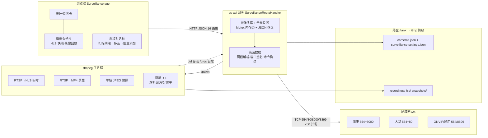

# SURVEILLANCE.md — 监控摄像头应用（网段扫描发现 + 拉流录像 + 存储/批量管理）

> 组件：`crates/os-api/src/handlers/surveillance.rs`（后端 16 路由）+
> `crates/os-api/web/src/views/Surveillance.vue`（前端）+
> `crates/os-api/web/src/api/client.ts`（surveillance 组）。
> 本文档为模块权威契约：端点 / 环境变量 / 存储布局 / 降级行为 / 测试锚点。

## 1. 组件拓扑（PPT 素材级）

```
                        ┌────────────────────────────────────────────────────────────┐
                        │                    浏览器（桌面 Web UI）                     │
                        │  Surveillance.vue                                           │
                        │  ├─ 统计卡 / 录像存储设置卡（recording_dir + 占用概览）      │
                        │  ├─ 摄像头卡片（HLS 播放 · 快照占位 · 探测/录像/回放）       │
                        │  └─ 添加对话框 ── 扫描网段 → 多选 → 批量添加(统一账号密码)   │
                        └───────────┬──────────────────────────────┬─────────────────┘
                          JSON/HTTP │（client.ts surveillance 组） │ HLS/MP4 直链
                        ┌───────────▼──────────────┐   ┌───────────▼───────────────┐
                        │  os-api 网关（Axum）       │   │  静态服务 /hls/<id>/      │
                        │  SurveillanceRouteHandler │   │  /api/v1/surveillance/    │
                        │  ├ 摄像头库（Mutex<Vec>）  │   │  rec-file（网关可选映射） │
                        │  ├ 全局设置（Mutex）       │   └───────────┬───────────────┘
                        │  └ 命令构造器（纯函数）     │               │
                        └──┬─────────┬────────┬────┘               │
              TCP 探测 554/80/8000/8899│  spawn ffmpeg │              │
                        ┌─────────────▼──┐  ┌──▼──────────────────▼──────────────┐
                        │  局域网 /24     │  │  ffmpeg 子进程                       │
                        │  ┌──────────┐  │  │  ├ RTSP→HLS（实时, libx264）        │
                        │  │ 海康/大华 │──┼──┤  ├ RTSP→MP4（录像, -c copy）        │
                        │  │ ONVIF/通用│  │  │  ├ 单帧 JPEG（快照, -frames:v 1）   │
                        │  └──────────┘  │  │  └ 探测（-t 1, stderr 解析编码/分辨率）│
                        └────────────────┘  └──┬──────────────┬───────────────────┘
                                              │落盘           │pid（/proc/<pid> 自愈）
                        ┌─────────────────────▼──┐  ┌──────────▼──────────────────┐
                        │ /tank/os-data/          │  │ 运行态（重启即清，永不 panic）│
                        │  ├ cameras.json（库）   │  └─────────────────────────────┘
                        │  └ surveillance-settings.json（recording_dir）           │
                        │ /tank/recordings/<id>/<YYYYMMDD>/<HHmmss>.mp4（可配置）  │
                        │ /tank/hls/<id>/index.m3u8 · /tank/snapshots/<id>/latest.jpg │
                        └─────────────────────────┘（/tank 不可写一律降级 /tmp 同构路径）
```

Mermaid 版（贴 PPT 用）：



## 2. 端点契约（16 条）

| method | path | auth | 请求 | 响应（200/201） | 错误 |
|---|---|---|---|---|---|
| GET | `/api/v1/surveillance/cameras` | 无 | — | `[Camera]`（先 /proc 自愈死 pid） | — |
| POST | `/api/v1/surveillance/cameras` | admin | `{name, url, protocol?}` | `201 Camera` | 400 空 name/url |
| POST | `/api/v1/surveillance/cameras/batch` | admin | `{items:[{ip?, rtsp_url, vendor?}], username?, password?, name_prefix?}` | `{created, failed, results:[{index, ok, name, url, error?, camera_id?}]}`（逐台反馈；单台失败不影响其余；名字 `prefix-1..N`，缺省 `cam`） | 400 items 空 |
| DELETE | `/api/v1/surveillance/cameras/:id` | admin | — | `{ok, id, action}`（先 kill 录像/拉流 pid） | 404 |
| POST | `/api/v1/surveillance/cameras/:id/probe` | admin | — | `Camera` + `probe_detail:{online, codec?, resolution?}`（ffmpeg stderr 解析） | 404 |
| POST | `/api/v1/surveillance/cameras/:id/stream` | admin | — | `Camera`（RTSP→HLS，`/tank/hls/<id>/`） | 404 |
| POST | `/api/v1/surveillance/cameras/:id/stop-stream` | admin | — | `Camera` | 404 |
| POST | `/api/v1/surveillance/cameras/:id/record` | admin | — | `Camera`（RTSP→MP4，写 `recording_dir/<id>/<date>/`） | 404 |
| POST | `/api/v1/surveillance/cameras/:id/stop-record` | admin | — | `Camera` | 404 |
| POST | `/api/v1/surveillance/cameras/:id/snapshot` | admin | — | `{camera_id, path, modified_at, data_url}`（JPEG base64） | 404；500 ffmpeg 失败/超时 |
| GET | `/api/v1/surveillance/cameras/:id/snapshot` | 无 | — | 同上（最近快照） | 404 无快照 |
| GET | `/api/v1/surveillance/cameras/:id/recordings` | 无 | — | `[RecordingEntry]`（多根合并：当前配置 + `/tank/recordings` + `/tmp/recordings`） | — |
| POST | `/api/v1/surveillance/scan` | admin | `{subnet?}`（缺省本机默认路由网段） | `{subnet, scanned, found, timed_out, hits:[{ip, ports, vendor_guess, rtsp_template, added}]}` | 400 subnet 非法/推断失败 |
| GET | `/api/v1/surveillance/settings` | 无 | — | `{recording_dir, default_recording_dir, writable, usage_bytes, file_count, legacy_dirs, note}` | — |
| POST | `/api/v1/surveillance/settings` | admin | `{recording_dir}` | `{ok, recording_dir, note}`（只影响**新**录像；存量留原路径仍可见） | 400 相对路径/含 `..`/不可写 |
| GET | `/api/v1/surveillance/stats` | 无 | — | `{camera_count, online, recording, storage_used_bytes}`（storage=真实目录占用，空则回落 4.5GiB/h·路估算） | — |

## 3. 网段扫描算法（任务 1）

- **网段推断**：`subnet` 缺省 → `ip -j -4 route show default` 的 `prefsrc`（本机主网卡
  IP，如 `192.0.2.106`）掩成 `/24`。无默认路由 → 400 提示显式指定。
- **解析约束**：仅支持 IPv4 `/24 ~ /32`（≤256 台，保证收敛）；主机位自动掩掉
  （`192.0.2.77/24` ≡ `192.0.2.0/24`）；裸 IP 默认 `/24`。
- **探测**：/24 内 254 台（跳过网络/广播地址），**50 并发**、每 IP 4 端口并发 connect、
  **单连接 300ms**、**整体 8s** 上限；超时返回已得部分 + `timed_out:true`。
- **特征端口**：554（RTSP）、80（Web）、8000（海康 Web/ONVIF）、8899（ONVIF 发现）。
- **端口签名 → 厂商/RTSP 模板**（`vendor_signature` 纯函数）：

  | 开放端口 | vendor_guess | rtsp_template |
  |---|---|---|
  | 554+8000 | hikvision | `rtsp://user:pass@{ip}:554/h264/ch1/main/av_stream` |
  | 554+80 | dahua | `rtsp://user:pass@{ip}:554/cam/realmonitor?channel=1&subtype=0` |
  | 仅 554 | generic | `rtsp://user:pass@{ip}:554/` |
  | 8000（无 554） | hikvision | 同海康模板（RTSP 或被过滤） |
  | 8899 | onvif | `rtsp://user:pass@{ip}:554/` |
  | 仅 80 | —（不收录） | 路由器/NAS 等通用 Web 服务会刷屏，非摄像头特征 |

- **added 标注**：库内摄像头 URL 经 `extract_host_from_url` 剥 scheme/userinfo/端口取
  host，命中即 `added:true`（前端置灰不可再勾选）。
- **HTTP 指纹**：预留增强位（当前仅端口签名，足够海康/大华/OVIF 三大类区分）。

## 4. 批量添加（扫描结果多选）

同型号同网段场景：扫描 → 勾选 N 条 → 填一组账号密码（+可选名称前缀）→ 后端把每条
模板里的 `user:pass` 占位替换为**百分号编码后**的凭证（`a@b#c` → `a%40b%23c`），
逐台创建、逐台反馈；某条 `rtsp_url` 为空只标记该条失败。名字自动 `prefix-1..N`。
也支持单选「填入表单」走手动添加流（预填模板 + 厂商命名）。

## 5. 存储布局与设置（新需求：存储路径可设置）

```
/tank/os-data/cameras.json                    # 摄像头库（原有）
/tank/os-data/surveillance-settings.json      # 全局设置 {recording_dir}（新增）
<tank|env 覆盖>/recordings/<id>/<YYYYMMDD>/<HHmmss>.mp4   # 录像（根目录可改）
/tank/hls/<id>/index.m3u8                     # 实时 HLS 段
/tank/snapshots/<id>/latest.jpg               # 快照（JPEG，覆盖式）
```

- **env `NEXOS_SURVEILLANCE_DIR`**：录像根目录初始默认（未设 → `/tank/recordings`
  历史落盘点，零行为变化）。
- **POST /settings**：绝对路径校验（`/` 开头、无 `..`）+ `create_dir_all` + 写探测
  文件双重可写校验；通过后更新内存态并落 `surveillance-settings.json`。
- **改路径语义**：只影响**新**录像；存量录像**不迁移**，录像列表多根合并扫描仍可见
  （响应 note 字段明示）。快照/HLS 目录不受影响（独立于录像根）。
- **占用概览**：GET /settings 返回 `usage_bytes`/`file_count`（递归 du，深度上限 8）。

## 6. 任务 2 功能（调研后实现 3 项）

| 候选 | 决定 | 理由 |
|---|---|---|
| ① 测试连接（流参数） | ✅ 实现（并入 probe） | probe 原有 online/offline 之上，从 ffmpeg stderr 解析编码+分辨率（`Stream ... Video: h264 ..., 1920x1080`），零新端点、纯函数易测 |
| ② 快照 | ✅ 实现（JPEG） | 抓单帧 `-frames:v 1 -q:v 2`；格式取 JPEG 而非任务书候选里的 PNG：1080p PNG 2-5MB，base64 JSON 查看 payload 过重，JPEG 质量 2 视觉等同且 ~200KB |
| ③ 流健康自愈 | ✅ 实现 | `/proc/<pid>` 检测 ffmpeg 存活；死进程自动清 pid/回落 offline，前端占位图恢复——修掉"ffmpeg 崩了卡片永远显示在推流"的陈旧态，成本最低价值高 |
| ④ 录像过滤/删除 | ❌ 未做 | "按摄像头过滤"天然已有（recordings 本就按 `/cameras/:id` 查询）；删除属破坏性文件操作，优先级低于在线体验修复，留待后续 |

## 7. 降级链（组件铁律：不 panic）

| 故障 | 行为 |
|---|---|
| ffmpeg 不存在 / spawn 失败 | `Camera.error` 记原因，状态保持/回落，端点仍 200/500 带说明 |
| RTSP 不可达 / 超时 | probe/snapshot 判失败并写 error；扫描端口不通即关闭 |
| /tank 不可写 | HLS/录像/快照全部降级 `/tmp` 同构路径 + warning |
| 扫描整体超时 | 返回已得部分 + `timed_out:true` |
| settings 文件损坏/缺失 | 回落 env 默认（`/tank/recordings`） |
| 网关无 /hls 静态映射 | 前端 `<video>` 静默失败（不报错弹窗） |

## 8. 环境变量

| 变量 | 作用 | 缺省 |
|---|---|---|
| `NEXOS_SURVEILLANCE_DIR` | 录像根目录初始默认（首次启动 / settings 文件缺失时） | `/tank/recordings` |

## 9. 测试锚点（`cargo test -p os-api surveillance`，38 条）

- 扫描：`parse_subnet_masks_host_bits_and_accepts_forms` / `parse_subnet_rejects_invalid`
  （/16、/33、非 IP → 400）；`subnet_hosts_skips_network_and_broadcast`；
  `vendor_signature_maps_port_signatures`（6 类签名）；`extract_host_from_url_variants`；
  `apply_credentials_encodes_and_replaces`（特殊字符百分号编码）；
  `scan_with_injected_prober_marks_added_and_vendor`（注入探测函数，不触网络）；
  `scan_marks_added_ip_from_existing_camera_urls`；
  `scan_timeout_returns_partial_results`（慢探测 400ms 截断 → timed_out + 部分结果）；
  `scan_endpoint_rejects_invalid_subnet`（400）；`infer_local_subnet_is_parseable_when_present`。
- 设置：`resolve_default_recording_dir_env_or_fallback`；
  `settings_post_updates_dir_persists_and_feeds_recordings`（落盘 + 多根可见）；
  `settings_post_rejects_relative_and_unwritable`；`record_filepath_in_uses_base_dir_and_falls_back`；
  `scan_recordings_in_merges_multiple_roots`；`dir_usage_counts_files_and_bytes`。
- 批量：`batch_create_mixed_results_with_credentials`（2 成 1 败逐台反馈）；
  `batch_empty_items_rejected`；`batch_default_prefix_when_missing`。
- 快照/探测/自愈：`build_snapshot_cmd_tokens`；`parse_stream_info_from_ffmpeg_stderr`
  （h264/mjpeg/无分辨率/无 Video 行）；`snapshot_get_missing_returns_404`；
  `snapshot_view_reads_latest_jpg`（base64 data URL）；`list_reconciles_dead_pids`
  （死 pid 清理 + 活 pid 保留）。
- 鉴权矩阵：`routes_declares_sixteen_endpoints`（POST/DELETE 全 admin；GET 全免认证）。
